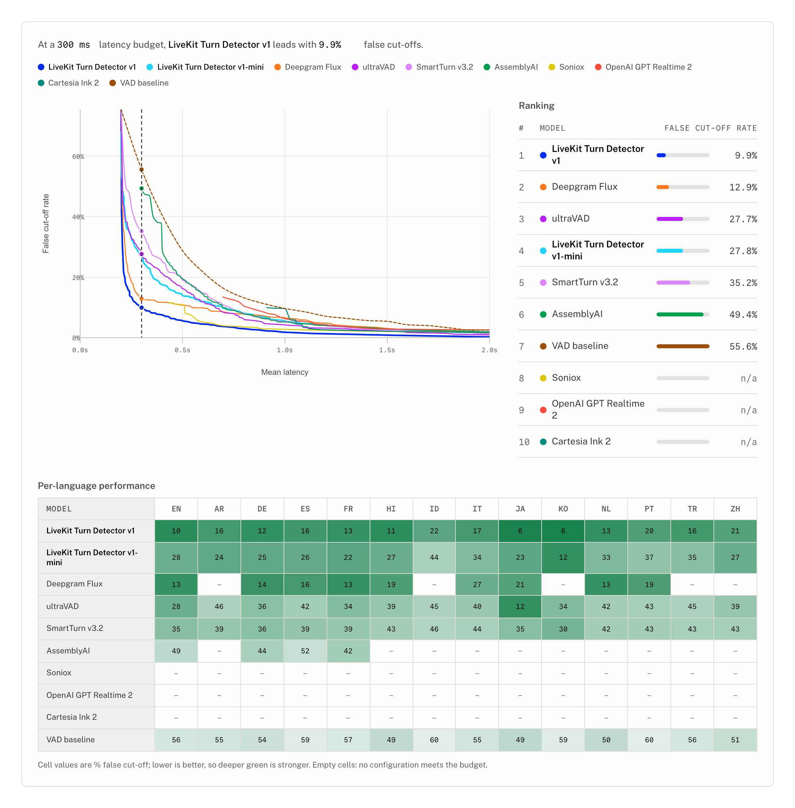
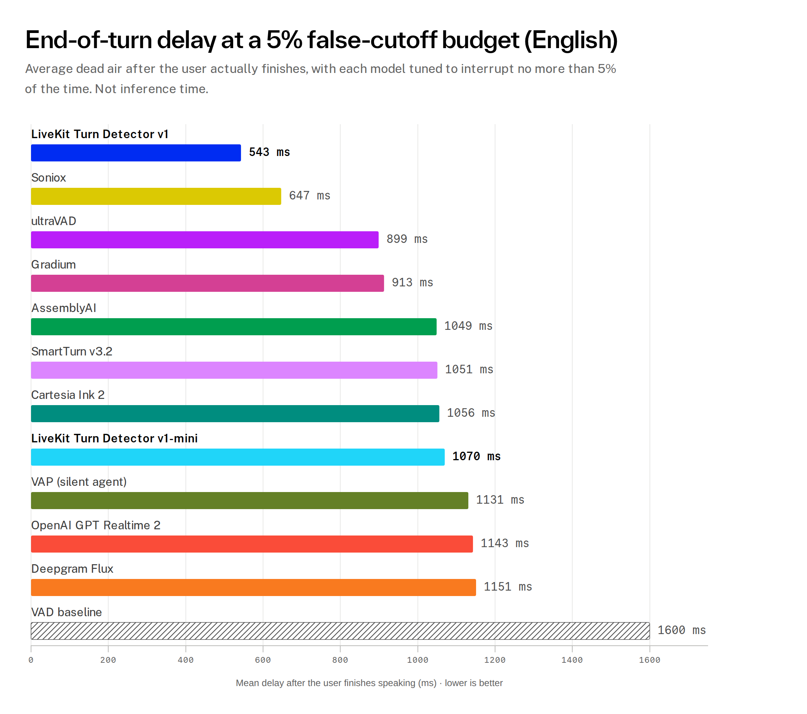

# eot-bench

### The open benchmark for end-of-turn detection

[](https://livekit.com/benchmarks/eot-bench)
[](https://huggingface.co/datasets/livekit/eot-bench-data/)
[](LICENSE)
[](pyproject.toml)

Every voice agent has to answer the same question, over and over, on every
pause: **is the user done talking?** Answer too early and the agent talks over
people; answer too late and the conversation fills with dead air. End-of-turn
(EoT) detection is the difference between an agent that feels like a
conversation and one that feels like a walkie-talkie, and it has been one of the
hardest open problems in voice AI since the first agents shipped.

It has also been hard to measure as a field. There's a lot of strong work on
end-of-turn detection, but no shared, public way to compare it: results come
from different private datasets and different methodologies, which makes them
difficult to reproduce or line up side by side. What's been missing is common
ground.

**eot-bench is that common ground.** It's an open, reproducible benchmark, paired
with the first open [dataset](https://huggingface.co/datasets/livekit/eot-bench-data)
of real human-to-agent conversations in 14 languages. Instead of scoring models
on isolated clips, it evaluates them the way a live voice agent does: at real
pauses, under real latency and interruption budgets. We built it to evaluate
[LiveKit Turn Detector v1](https://livekit.com/blog/solving-end-of-turn-detection),
and we're releasing it so anyone building an EoT model can measure on the same
footing.

## The dataset: real conversations, 14 languages

[**`livekit/eot-bench-data`**](https://huggingface.co/datasets/livekit/eot-bench-data) is
the first open dataset of its kind for end-of-turn detection: **real
human-to-agent user turns**, with **aligned audio and textual context**, across
**14 languages**: Arabic, Chinese, Dutch, English, French, German, Hindi,
Indonesian, Italian, Japanese, Korean, Portuguese, Spanish, and Turkish.

Each row is a complete user turn from a task-oriented conversation, annotated
with every silence pause of at least 100 ms. The final pause is the true end of
the turn; every earlier pause is a mid-turn hesitation the agent should listen
through. That structure is what lets the benchmark score a model on the *actual*
decisions a voice agent faces, rather than on isolated clips. It's freely
available for download and evaluation, Apache-2.0 alongside this repo.

## Results

LiveKit Turn Detector v1 posts the strongest overall results of any model we
evaluated, in English and across all 14 languages. Explore the full
**[interactive leaderboard »](https://livekit.com/benchmarks/eot-bench)**. Set a
latency or false-cutoff budget and watch every model re-rank on the Pareto
frontier and the per-language heatmap.

<a href="https://livekit.com/benchmarks/eot-bench">
  <picture>
    <source media="(prefers-color-scheme: dark)" srcset="assets/leaderboard_dark.png">
    
  </picture>
</a>

The clearest single view is how much dead air each model leaves at a fixed
interruption budget. Tuned to interrupt the user no more than 5% of the time,
how long after the user has actually finished does the agent wait before
responding? Lower means a snappier conversation. (This is endpointing delay, not
model inference time.)

<picture>
  <source media="(prefers-color-scheme: dark)" srcset="assets/headline_latency_en_dark.png">
  
</picture>

English models at four operating points, ordered by false cutoffs at a 300 ms
latency budget (best first). Lower is better on every metric:

| Model | False cutoffs @ 300 ms | False cutoffs @ 600 ms | Latency @ 5% cutoff | Latency @ 10% cutoff |
| --- | ---: | ---: | ---: | ---: |
| **LiveKit Turn Detector v1** | **9.9%** | **4.5%** | **543 ms** | **295 ms** |
| Deepgram Flux | 12.9% | 9.9% | 1151 ms | 548 ms |
| ultraVAD | 27.7% | 11.9% | 899 ms | 663 ms |
| LiveKit Turn Detector v1-mini | 27.8% | 12.1% | 1070 ms | 698 ms |
| SmartTurn v3.2 | 35.2% | 14.8% | 1051 ms | 739 ms |
| AssemblyAI | 49.4% | 14.6% | 1049 ms | 713 ms |
| Soniox | – | 5.5% | 647 ms | 512 ms |
| OpenAI GPT Realtime 2 | – | – | 1143 ms | 824 ms |
| VAD baseline | 55.6% | 21.7% | 1600 ms | 1000 ms |

A `–` means no policy setting reached that latency budget. The silence-only
**VAD baseline** runs through the identical evaluation, so every learned and
commercial detector is always measured against timing alone. All numbers are
generated from the reproducible artifacts committed under [`output/`](output/).
The [interactive leaderboard](https://livekit.com/benchmarks/eot-bench) adds the
full Pareto frontier and the breakdown across all 14 languages.

## Why false cutoffs vs. latency

A good turn detector has to satisfy two goals that pull against each other.

The first is to **never cut the user off**. Interrupting before someone has
finished a thought is the most jarring failure a voice agent can make, so the
primary objective is to minimize the **false-cutoff rate**: firing on a mid-turn
pause that wasn't actually the end of the turn. The second is to **respond
quickly** once the user *is* done, so the conversation keeps flowing instead of
filling with dead air. That's **latency**: the time the agent waits after a true
turn ending before taking the floor.

Latency here is conversational dead air, not compute. It's how long the policy
holds before it's confident the turn is over, not how fast the model runs
inference. An instant model that waits 600 ms to be sure still shows 600 ms of
latency. Minimizing it means deciding correctly *sooner*, not computing faster.

You can trivially win either goal alone: wait forever and you'll never interrupt;
fire instantly and you'll never lag. What matters is the **tradeoff** between
them. eot-bench measures that tradeoff directly. For every model it sweeps the
endpointing policy, then reports the best latency achievable at a fixed
false-cutoff budget (and vice versa), plus the full Pareto frontier. Lower-left
is better: fewer interruptions, faster responses. A single accuracy score can't
capture this, which is why the benchmark is built around the tradeoff instead.
See [Evaluation Model](#evaluation-model) for the full methodology.

## What's included

- The public turn-level dataset [`livekit/eot-bench-data`](https://huggingface.co/datasets/livekit/eot-bench-data):
  real human-to-agent turns with audio and text context in 14 languages.
- Batch and streaming adapter interfaces for local models and provider APIs,
  with reference adapters for LiveKit Turn Detector v1 / v1-mini, Deepgram Flux,
  AssemblyAI, Soniox, OpenAI GPT Realtime, SmartTurn, and ultraVAD.
- Reproducible prediction artifacts, policy-sweep metrics, Pareto frontiers,
  operating-point tables, and multilingual heatmaps committed under `output/`.
- CLI commands for running a new adapter against one language or every supported
  dataset language, plus a Modal runner for scaled batch jobs.

## Quick Start

From the repo root:

```bash
python -m pip install -e ".[dev]"
```

Regenerate the committed English comparison artifacts:

```bash
eot-harness compare-models \
  output/livekit__eot-bench-data__validation__min_silence_100ms/en
```

Regenerate the multilingual operating-point artifacts:

```bash
eot-harness compare-languages \
  output/livekit__eot-bench-data__validation__min_silence_100ms
```

## Evaluation Model

The evaluation is built around the decision an EoT model has to support in a
production voice agent: at each silence, should the assistant respond now or
keep listening? Instead of treating EoT detection as offline classification over
isolated clips, the harness evaluates complete turns as causal silence
decisions, then compares the policies those scores can support.

### Span-Level Decisions

Each dataset row is a complete human user turn from a task-oriented
conversation. The row includes every silence span of at least 100 ms. The final
silence span is the true end of the user's turn and is labeled `eot`; every
earlier silence span is a mid-turn pause and is labeled `hold`.

The harness asks each model to score those spans causally. For a prediction at
time `t`, the adapter receives only the audio, transcript context, and messages
that would have been available by `t`. This matters because EoT errors
usually happen at ambiguous pauses inside a real turn, not at isolated clips
where the model can implicitly rely on future context or offline segmentation.

Span-level evaluation turns each user turn into the actual decision points a
voice system sees. A good model assigns high EoT probability to the final
silence while keeping probability low through ordinary hesitations and mid-turn
pauses.

### Policy Sweep and Operating Points

Raw model scores are not enough to compare models. Production systems apply a
policy on top of the score, and that policy determines the user-visible
tradeoff between responding quickly and avoiding false cutoffs. The harness
sweeps the policy space instead of judging one hand-picked threshold or timeout.

The swept policy has three knobs:

1. `threshold`: the EoT confidence needed to end the user turn.
2. `action_delay`: the minimum silence duration before the system is allowed to
   act on the model score.
3. `timeout`: the maximum silence duration the system will hold before ending
   the turn even if the model has not fired.

The harness evaluates these knobs together. Raising `action_delay` can reduce
false interruptions by ignoring short mid-turn pauses, but it adds the same
latency to every correctly detected true turn ending. Raising `timeout` lets the
system tolerate longer mid-turn pauses, but it makes false negatives more
expensive because a missed true end-of-turn leaves the assistant waiting until
the timeout expires.

Comparison reports focus on operating points under explicit false-cutoff and
latency budgets, plus the latency/cutoff Pareto frontier. They also include a
VAD-only baseline evaluated on the same policy grid, so learned EoT models are
compared against silence timing alone.

Scalar classification metrics such as `auc` and `ap` remain available in
per-run diagnostics, but they do not rank models or drive comparison reports.
They answer a different question from deployment behavior and can be misleading
for streaming APIs that expose events after an internal server-side hold or
action delay. Short mid-turn pauses may look correctly rejected without putting
the corresponding latency cost on an explicit policy knob. The policy sweep
keeps that cost visible in the latency/cutoff frontier and named operating
points.

## Scope

The harness expects an existing dataset in the public EoT benchmark schema.
Dataset construction, annotation, VAD extraction, and source-specific ingestion
live outside this package.

Required dataset fields:

- `id`
- `language`
- `audio`
- `silence_spans`

Optional dataset fields:

- `messages`
- `words`

`audio` is a Hugging Face [`Audio`](https://huggingface.co/docs/datasets/about_dataset_features#audio-feature)
feature. The harness loads it with the column cast to `Audio(decode=False)` — so
no `torchcodec` runtime decoder is required — and decodes the raw bytes itself
with `soundfile`. Rows may therefore arrive either encoded as `{"bytes": ...}`
or already decoded as `{"array": ..., "sampling_rate": ...}`; the harness handles
both.

`silence_spans` is a list of spans with `start` and `end` seconds. Prediction
generation skips spans shorter than `0.1s`. Every generated span is labeled
`hold` unless it is the final span in `silence_spans`, which is labeled `eot`.

If `messages` is present, it is copied into each causal adapter input. If
`words` is present, the harness appends a current-turn user message containing
words whose `end` time is at or before `timestamp - transcript_lag`. When both
fields are absent, adapters receive an empty `messages` list.

The `language` column is always required. The harness does not interpret the
dataset config name after loading; it writes artifacts under one child directory
per observed row language.

## Setup

From the repo root:

```bash
python -m pip install -e .
```

For local development and tests:

```bash
python -m pip install -e ".[dev]"
```

Runtime dependencies cover the core harness, Hugging Face dataset I/O, the
Modal runner, plotting, and the Deepgram streaming client. `requirements.txt`
mirrors those runtime dependencies for environments that prefer requirements
files. The local LiveKit, Smart Turn, and UltraVAD model adapters import heavier
model runtimes lazily, such as `livekit-local-inference`, `transformers`,
`onnxruntime`, `torch`, and `torchaudio`. Install those separately for local
model runs, or use the Modal runner presets, which build images with the needed
model dependencies.

The CLI and Modal runner load auth from `eot_harness/.env` with
`python-dotenv`. Copy `eot_harness/.env.example` to `eot_harness/.env` and use
the canonical key names:

```dotenv
HF_TOKEN=...
LIVEKIT_API_KEY=...
LIVEKIT_API_SECRET=...
# Optional: override the inference gateway (e.g. a local server).
# LIVEKIT_INFERENCE_URL=http://localhost:8080/v1
DEEPGRAM_API_KEY=...
ASSEMBLYAI_API_KEY=...
SONIOX_API_KEY=...
XAI_API_KEY=...
SPEECHMATICS_API_KEY=...
OPENAI_API_KEY=...
GRADIUM_API_KEY=...
```

<details>
<summary><b>Batch Prediction</b></summary>

Run a pointwise batch adapter:

```bash
eot-harness predict \
  --path livekit/eot-bench-data \
  --name all \
  --split validation \
  --adapter eot_harness.livekit_turn_detector_mini_adapter:LiveKitTurnDetectorMiniAdapter \
  --output-dir output
```

`--repo-id` and `--subset` remain accepted aliases for `--path` and `--name`.

Useful options:

- `--min-silence-span`: defaults to `0.1` seconds and defines the dataset
  span set for prediction.
- `--batch-size`: defaults to `128`.
- `--inference-interval`: defaults to `0.1` seconds.
- `--transcript-lag`: defaults to `0.5` seconds.
- `--overwrite`: replace an existing model run with the same model options.

Batch prediction writes a span-set parent directory under `--output-dir`:

```text
output/livekit__eot-bench-data__validation__min_silence_100ms/
  en/
    span_set.parquet
    span_set_manifest.json
    live_kit_turn_detector_mini_adapter__<options-hash>/
      predictions.parquet
      manifest.json
  de/
    span_set.parquet
    span_set_manifest.json
    live_kit_turn_detector_mini_adapter__<options-hash>/
      predictions.parquet
      manifest.json
```

The span-set root directory is determined by `path`, `split`, and
`min_silence_span`. The dataset `name` is only passed through to
`load_dataset`; row `language` values determine child directories. The model
directory is determined by the adapter name and a hash of prediction-affecting
model options. The harness validates that each model run's predictions contain
exactly the parent language span set, defined as the unique `(id, span_index)`
pairs.

Adapters expose `supports_language(lang_code)`. When the loaded dataset has
multiple languages, unsupported languages are skipped before inference. With
`--overwrite` unset, complete existing language/model artifacts are skipped too,
so rerunning `--name all` fills only missing supported languages.

Prediction commands log progress to stderr every 30 seconds by default,
including elapsed time, throughput, and ETA. Use `--progress-interval 0` to
disable progress logs.

Each model run writes:

- `predictions.parquet`
- `manifest.json`

`predictions.parquet` has one row per scored timestamp:

- `id`
- `language`
- `span_index`
- `timestamp`
- `silence_dur`
- `p_eot`
- `label`

</details>

<details>
<summary><b>Streaming Prediction</b></summary>

Run a streaming/API adapter:

```bash
eot-harness predict-streaming \
  --path livekit/eot-bench-data \
  --name all \
  --split validation \
  --adapter eot_harness.livekit_turn_detector_adapter:LiveKitTurnDetectorAdapter \
  --output-dir output
```

The LiveKit cloud audio adapter streams each turn to the LiveKit Turn Detector v1
(`turn-detector-v1`) model over the agent-gateway EOT websocket protocol. For every scored silence-span grid
point it feeds audio up to that timestamp and issues an explicit inference
request, so each `p_eot` reflects exactly the causal audio the harness exposes.
It requires `LIVEKIT_API_KEY` and `LIVEKIT_API_SECRET`; set `LIVEKIT_INFERENCE_URL`
to target a non-default gateway (e.g. `http://localhost:8080/v1` for a local
server).

The streaming command loads full dataset rows and lets the adapter produce
prediction rows for each turn. It writes the same per-language span-set/model-run
layout as batch prediction and skips complete existing language artifacts when
`--overwrite` is unset. It supports:

- `--concurrency`: defaults to the adapter's `concurrency` attribute, or `1`.
- `--model`: adapter model override when supported.
- `--chunk-ms`: streaming chunk size override when supported.
- `--eot-threshold`: Deepgram Flux EoT threshold override.
- `--limit`: only score the first N dataset rows, useful for API smoke tests.
- `--overwrite`: replace existing language/model run artifacts.
- `--progress-interval`: seconds between stderr progress logs; use `0` to disable.
- `--skip-unsupported-languages`: backward-compatible language skipping flag;
  unsupported rows are filtered before API calls when the adapter exposes
  `supports_language(lang_code)`.
- `--skip-errors`: record failed streaming rows in `skipped.parquet` instead of
  aborting the whole run.

Streaming API adapters require their provider-specific credentials in
`eot_harness/.env`, such as `LIVEKIT_API_KEY`/`LIVEKIT_API_SECRET`,
`DEEPGRAM_API_KEY`, `ASSEMBLYAI_API_KEY`,
`SONIOX_API_KEY`, `XAI_API_KEY`, `SPEECHMATICS_API_KEY`, `OPENAI_API_KEY`, or
`GRADIUM_API_KEY`.
The AssemblyAI adapter also accepts `ASSEMBLY_API_KEY` and `ASSEMBLY_AI_KEY` as
local aliases.

Each streaming model run writes:

- `predictions.parquet`
- `events.parquet`
- `manifest.json`
- `summary.json`
- `skipped.parquet`, only when rows are skipped

</details>

<details>
<summary><b>Metrics</b></summary>

Compute metrics from any conforming `predictions.parquet`:

```bash
eot-harness compute-metrics \
  --predictions output/livekit__eot-bench-data__validation__min_silence_100ms/en/live_kit_turn_detector_adapter__OPTIONS_HASH/predictions.parquet \
  --score-point 0.2 \
  --output-dir output/livekit__eot-bench-data__validation__min_silence_100ms/en/live_kit_turn_detector_adapter__OPTIONS_HASH/metrics
```

Metrics output:

- `tradeoff.parquet`
- `summary.json`

Metric defaults:

- `--score-point` defaults to the prediction manifest's `score_point` when
  present. If neither is available, scalar metrics use each span's max score and
  policy metrics use the first threshold crossing in each span.
- `--min-hold-span-duration` defaults to `0.2` seconds.
- `--max-hold-span-duration` defaults to `5.0` seconds.

Only hold spans are filtered by the min/max hold-span duration. True EoT spans
are kept and must have a score. When `--score-point` is set, that score point
must exist on the prediction grid for every span that survives to that duration;
for example, `--score-point 0.2` is compatible with the default `0.1s`
inference interval.

The per-run metric summary includes scalar classification diagnostics (`auc`,
`ap`) and a joint threshold/action-delay/timeout sweep with a VAD-only baseline.
Use the sweep-derived operating points for model comparisons; `auc` and `ap`
are diagnostic only and are intentionally omitted from comparison reports.

</details>

<details>
<summary><b>Model Comparison</b></summary>

Build a comparison report from the per-model metric artifacts under a span-set
directory:

```bash
eot-harness compare-models \
  output/livekit__eot-bench-data__validation__min_silence_100ms/en
```

`compare-models` does not recompute metrics. It discovers model run directories
with `metrics/tradeoff.parquet` and `metrics/summary.json`, validates that their
min/max hold-span duration settings match the command options, orders models by
best mean latency under the 5% false-cutoff budget, and uses `display_name` from
each prediction manifest when present. It writes:

```text
comparison/
  report.md
  pareto_frontier.png
  cutoff_rate_at_latency_budget_300_600ms.png
  latency_at_cutoff_budget_5_10pct.png
```

The report puts the Pareto frontier first, followed by operating-point bar
charts and tables for:

- best cutoff rate at 0.3s and 0.6s latency budgets
- best mean latency at 5% and 10% false-cutoff budgets

Each operating-point table includes the VAD baseline and bolds the best value in
each metric column. The final section contains the full operating-point table.
The Markdown report uses GitHub-renderable image references and tables.
`compare-models` does not write parquet or JSON artifacts into `comparison/`;
regenerating the report removes stale comparison-side parquet/JSON files from
older harness versions.

</details>

<details>
<summary><b>Language Comparison</b></summary>

Build operating-point heatmaps across every language directory under a span-set
root:

```bash
eot-harness compare-languages \
  output/livekit__eot-bench-data__validation__min_silence_100ms
```

`compare-languages` reads existing per-language model metrics and does not
recompute predictions or metrics. It writes the same policy operating points
used by `compare-models` into one report:

```text
language_comparison/
  summary.json
  metrics.parquet
  heatmap_best_cutoff_rate_at_0_3s_latency.png
  heatmap_best_cutoff_rate_at_0_6s_latency.png
  heatmap_best_mean_latency_at_5pct_cutoff.png
  heatmap_best_mean_latency_at_10pct_cutoff.png
  report.md
```

The heatmaps use the fully spelled-out operating-point names:

- Best cutoff rate @ 0.3s latency
- Best cutoff rate @ 0.6s latency
- Best mean latency @ 5% cutoff
- Best mean latency @ 10% cutoff

When a language directory includes `span_set.parquet`, the language comparison
also computes a fine-grid VAD baseline so it can appear beside learned and API
models in the heatmaps and metrics table.

</details>

<details>
<summary><b>Adapter Contracts</b></summary>

Adapter references may be written as `module:attribute` or `module.attribute`.
If the referenced attribute is a class, the harness instantiates it with no
arguments.

Batch adapters must define:

```python
class MyAdapter:
    adapter_id = "my-model"
    score_point = 0.2

    def predict_batch(self, batch):
        return [0.0 for _ in batch]
```

Each `batch` item contains:

- `audio`: the causal audio prefix for the prediction timestamp.
- `messages`: the causal message history after transcript-lag handling, or an
  empty list when the dataset has no text fields.

`predict_batch` must return one `p_eot` score per input.

Streaming adapters must define:

```python
class MyStreamingAdapter:
    adapter_id = "my-streaming-model"
    concurrency = 4

    async def predict_turn(self, row, *, inference_interval):
        return {
            "id": row["id"],
            "audio_sec": 0.0,
            "events": [],
            "prediction_rows": [],
        }
```

`prediction_rows` must use the same required score columns as batch
`predictions.parquet`: `id`, `span_index`, `timestamp`, `silence_dur`, `p_eot`,
and `label`. The harness fills `language` from the dataset row when a streaming
adapter omits it.
Streaming adapters can expose `supports_language(lang_code)` and should use
`row["language"]` for provider-specific language hints or request parameters.
Adapters may return `{"skipped": True, "id": ..., "reason": ...}` for skipped
turns.

Built-in adapter examples:

- `eot_harness.livekit_turn_detector_adapter:LiveKitTurnDetectorAdapter`
- `eot_harness.livekit_turn_detector_mini_adapter:LiveKitTurnDetectorMiniAdapter`
- `eot_harness.smart_turn_adapter:SmartTurnAudioAdapter`
- `eot_harness.ultravad_adapter:UltraVADAdapter`
- `eot_harness.deepgram_flux_adapter:DeepgramFluxStreamingAdapter`
- `eot_harness.assemblyai_adapter:AssemblyAIStreamingAdapter`
- `eot_harness.soniox_adapter:SonioxStreamingAdapter`
- `eot_harness.openai_realtime_adapter:OpenAIRealtime2Adapter`
- `eot_harness.gradium_adapter:GradiumStreamingAdapter`

Streaming STT adapters produce `p_eot` from the provider's native endpointing
surface. Deepgram Flux and AssemblyAI expose confidence-style scores. Soniox,
and OpenAI Realtime semantic VAD currently map endpoint events to binary scores:
`0.0` before the provider endpoint event has fired and `1.0` after it has fired.
The AssemblyAI adapter defaults to `universal-streaming-multilingual` with
`min_turn_silence=100`, `max_turn_silence=3000`, and
`end_of_turn_confidence_threshold=0.1` so the harness receives probability-valued
`end_of_turn_confidence` events across AssemblyAI's supported dataset languages.

`GradiumStreamingAdapter` streams 24kHz PCM turns through the Gradium
`stt_streaming` API (`gradium` PyPI package, imported lazily; `pip install
gradium`) and records the VAD inactivity probability
(`msg["vad"][3]["inactivity_prob"]`) from each 80ms `step` message as a
probability-valued `p_eot` score. The recommended end-of-turn condition is
`inactivity_prob > 0.5`, which corresponds to the `0.5` threshold operating
point in the harness metrics. It requires `GRADIUM_API_KEY` and targets
`https://api.gradium.ai/api` by default.

`LiveKitTurnDetectorAdapter` is a streaming adapter that scores each turn
with the LiveKit Turn Detector v1 (`turn-detector-v1`) cloud model over the
agent-gateway EOT websocket;
run it with `predict-streaming` and `LIVEKIT_API_KEY`/`LIVEKIT_API_SECRET`.

UltraVAD currently supports `--batch-size 1` only.

`LiveKitTurnDetectorMiniAdapter` parallelizes calls to the public local-inference
interface with up to 8 worker threads by default. Set
`LIVEKIT_TURN_DETECTOR_MINI_WORKERS=1` for single-threaded runs, or another positive
integer to tune local throughput.

The LiveKit text adapters in `eot_harness.livekit_text_adapter` are deprecated and
kept only for old comparisons.

Text fields are model-specific requirements, not global schema requirements.
UltraVAD consumes previous assistant text when `messages` is present. Deprecated
LiveKit text adapters need transcript text from `words` and/or `messages`.

</details>

<details>
<summary><b>Modal Batch Prediction</b></summary>

Run Modal-backed batch prediction jobs with the package-owned entrypoint:

```bash
modal run eot_harness.modal_runner::run_predict \
  --config-json '{"path":"livekit/eot-bench-data","name":"all","split":"validation","adapter":"eot_harness.livekit_turn_detector_mini_adapter:LiveKitTurnDetectorMiniAdapter","modal_preset":"audio"}'
```

The Modal runner writes the same `predictions.parquet` and `manifest.json` as
local `predict`, including the same span-set/model-run directory layout under
`--output-dir`, which defaults to `output`. Supported presets are `default`,
`audio`, and `ultravad`; choose one with `--preset` or by adding
`"modal_preset": "audio"` to the config JSON.

The Modal runner currently calls the batch `predict` path, not
`predict-streaming`.

</details>
