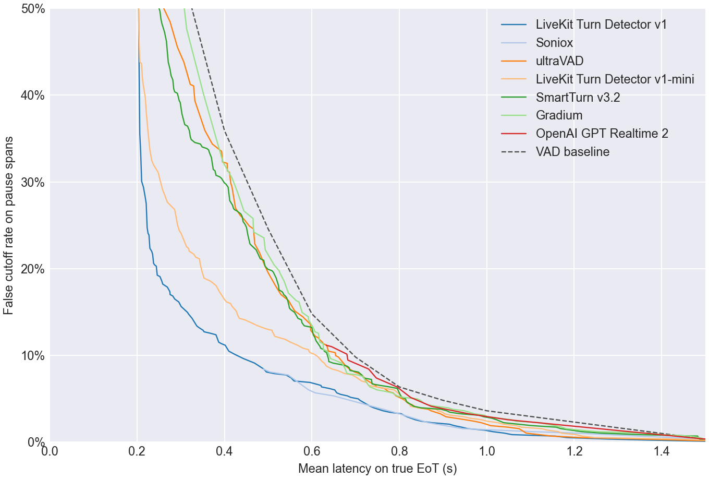
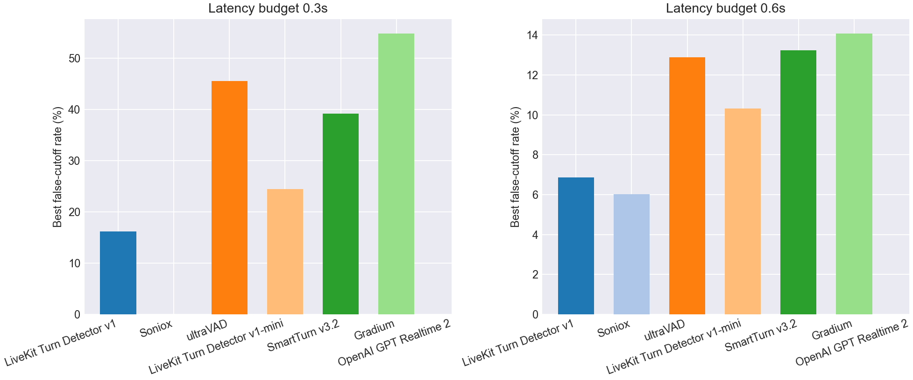
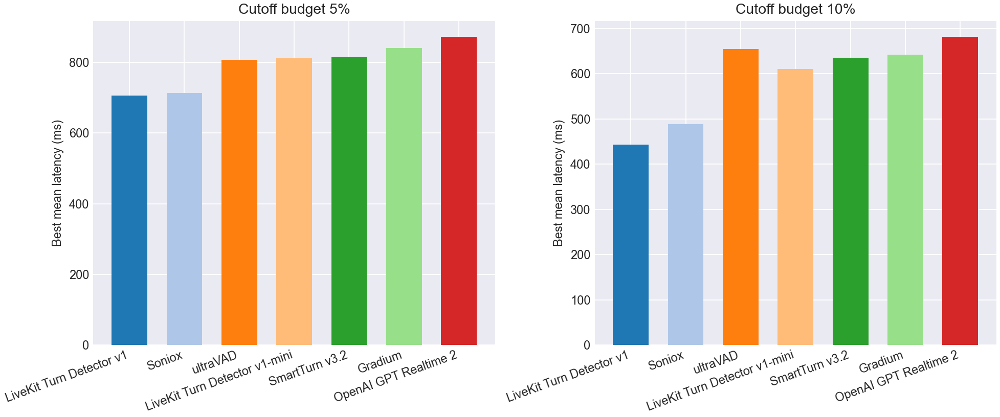

# EoT Model Comparison

## Pareto Frontier

## Best Cutoff Rate at Latency Budget

| Model | Best cutoff rate @ 0.3s latency | Best cutoff rate @ 0.6s latency |
| --- | --- | --- |
| LiveKit Turn Detector v1 | **16.2%** | 6.9% |
| Soniox | - | **6.0%** |
| ultraVAD | 45.5% | 12.9% |
| LiveKit Turn Detector v1-mini | 24.4% | 10.3% |
| SmartTurn v3.2 | 39.2% | 13.2% |
| Gradium | 54.8% | 14.1% |
| OpenAI GPT Realtime 2 | - | - |
| VAD baseline | 54.8% | 14.8% |

## Best Latency at Cutoff Budget

| Model | Best mean latency @ 5% cutoff | Best mean latency @ 10% cutoff |
| --- | --- | --- |
| LiveKit Turn Detector v1 | **706 ms** | **444 ms** |
| Soniox | 713 ms | 489 ms |
| ultraVAD | 807 ms | 654 ms |
| LiveKit Turn Detector v1-mini | 811 ms | 610 ms |
| SmartTurn v3.2 | 814 ms | 636 ms |
| Gradium | 840 ms | 643 ms |
| OpenAI GPT Realtime 2 | 873 ms | 682 ms |
| VAD baseline | 900 ms | 700 ms |

## Operating Points

| Type | Budget | Model | Mean Latency | Cutoff | Detect | Threshold | Action Delay | Timeout |
| --- | --- | --- | --- | --- | --- | --- | --- | --- |
| Cutoff | 5.0% | LiveKit Turn Detector v1 | 0.706 | 5.0% | 72.2% | 0.790 | 0.400 | 1.500 |
| Cutoff | 5.0% | Soniox | 0.713 | 4.5% | 79.3% | 0.990 | 0.500 | 1.500 |
| Cutoff | 5.0% | ultraVAD | 0.807 | 5.0% | 86.6% | 0.070 | 0.700 | 1.500 |
| Cutoff | 5.0% | LiveKit Turn Detector v1-mini | 0.811 | 5.0% | 98.4% | 0.120 | 0.800 | 1.500 |
| Cutoff | 5.0% | SmartTurn v3.2 | 0.814 | 5.0% | 92.9% | 0.090 | 0.800 | 1.000 |
| Cutoff | 5.0% | Gradium | 0.840 | 5.0% | 63.8% | 0.280 | 0.700 | 1.000 |
| Cutoff | 5.0% | OpenAI GPT Realtime 2 | 0.873 | 4.1% | 90.8% | 0.990 | 0.800 | 1.500 |
| Cutoff | 10.0% | LiveKit Turn Detector v1 | 0.444 | 9.6% | 69.6% | 0.800 | 0.200 | 1.000 |
| Cutoff | 10.0% | Soniox | 0.489 | 8.4% | 79.3% | 0.990 | 0.200 | 1.000 |
| Cutoff | 10.0% | ultraVAD | 0.654 | 10.0% | 94.0% | 0.040 | 0.600 | 1.500 |
| Cutoff | 10.0% | LiveKit Turn Detector v1-mini | 0.610 | 10.0% | 97.4% | 0.140 | 0.600 | 1.000 |
| Cutoff | 10.0% | SmartTurn v3.2 | 0.636 | 10.0% | 91.1% | 0.150 | 0.600 | 1.000 |
| Cutoff | 10.0% | Gradium | 0.643 | 9.6% | 89.8% | 0.140 | 0.500 | 1.000 |
| Cutoff | 10.0% | OpenAI GPT Realtime 2 | 0.682 | 9.5% | 90.0% | 0.990 | 0.600 | 1.000 |
| Latency | 300ms | LiveKit Turn Detector v1 | 0.296 | 16.2% | 92.7% | 0.460 | 0.200 | 1.500 |
| Latency | 300ms | Soniox | - | - | - | - | - | - |
| Latency | 300ms | ultraVAD | 0.292 | 45.5% | 88.5% | 0.060 | 0.200 | 1.000 |
| Latency | 300ms | LiveKit Turn Detector v1-mini | 0.297 | 24.4% | 87.9% | 0.270 | 0.200 | 1.000 |
| Latency | 300ms | SmartTurn v3.2 | 0.299 | 39.2% | 87.7% | 0.260 | 0.200 | 1.000 |
| Latency | 300ms | Gradium | 0.300 | 54.8% | 100.0% | 0.000 | 0.300 | 1.000 |
| Latency | 300ms | OpenAI GPT Realtime 2 | - | - | - | - | - | - |
| Latency | 600ms | LiveKit Turn Detector v1 | 0.596 | 6.9% | 69.6% | 0.800 | 0.200 | 1.500 |
| Latency | 600ms | Soniox | 0.592 | 6.0% | 79.3% | 0.990 | 0.200 | 1.500 |
| Latency | 600ms | ultraVAD | 0.597 | 12.9% | 80.6% | 0.100 | 0.500 | 1.000 |
| Latency | 600ms | LiveKit Turn Detector v1-mini | 0.596 | 10.3% | 80.8% | 0.390 | 0.500 | 1.000 |
| Latency | 600ms | SmartTurn v3.2 | 0.600 | 13.2% | 80.1% | 0.510 | 0.500 | 1.000 |
| Latency | 600ms | Gradium | 0.592 | 14.1% | 92.7% | 0.090 | 0.500 | 1.000 |
| Latency | 600ms | OpenAI GPT Realtime 2 | - | - | - | - | - | - |
