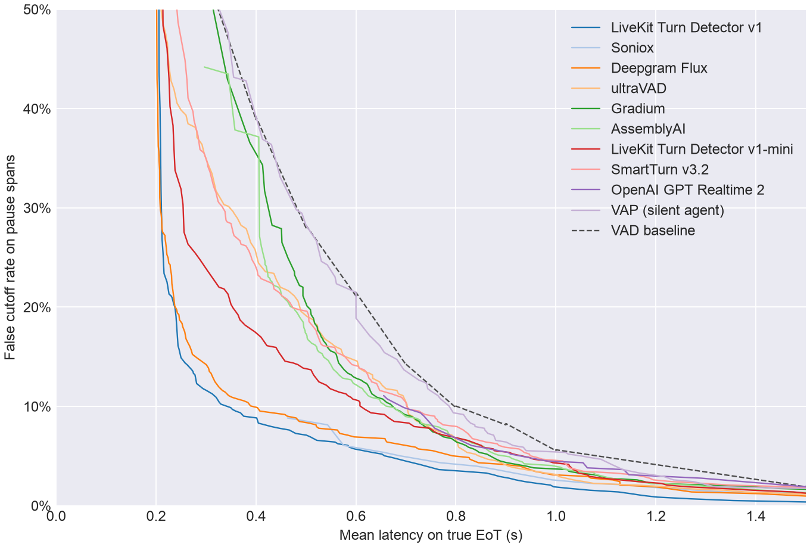
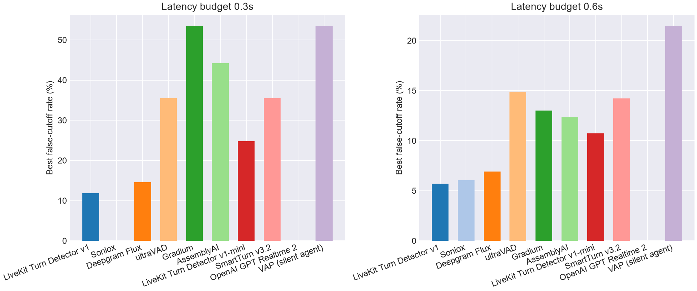
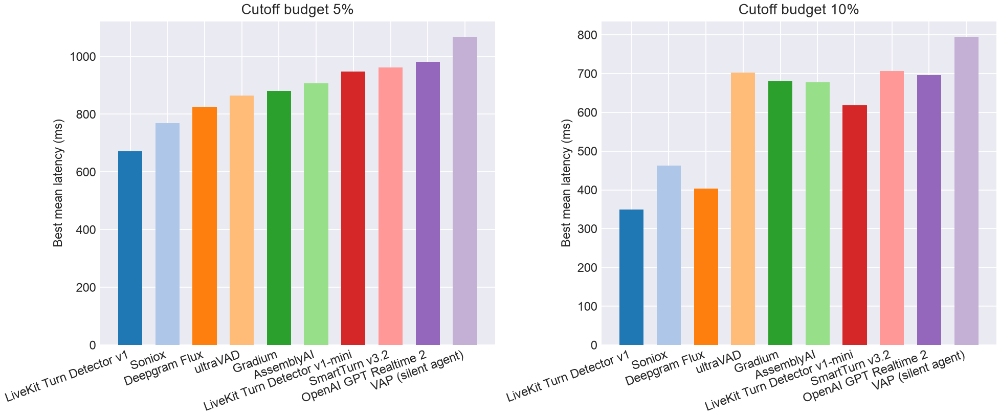

# EoT Model Comparison

## Pareto Frontier

## Best Cutoff Rate at Latency Budget

| Model | Best cutoff rate @ 0.3s latency | Best cutoff rate @ 0.6s latency |
| --- | --- | --- |
| LiveKit Turn Detector v1 | **11.8%** | **5.7%** |
| Soniox | - | 6.1% |
| Deepgram Flux | 14.6% | 6.9% |
| ultraVAD | 35.5% | 14.9% |
| Gradium | 53.6% | 13.0% |
| AssemblyAI | 44.2% | 12.3% |
| LiveKit Turn Detector v1-mini | 24.8% | 10.7% |
| SmartTurn v3.2 | 35.5% | 14.2% |
| OpenAI GPT Realtime 2 | - | - |
| VAP (silent agent) | 53.6% | 21.5% |
| VAD baseline | 53.6% | 21.5% |

## Best Latency at Cutoff Budget

| Model | Best mean latency @ 5% cutoff | Best mean latency @ 10% cutoff |
| --- | --- | --- |
| LiveKit Turn Detector v1 | **672 ms** | **350 ms** |
| Soniox | 768 ms | 463 ms |
| Deepgram Flux | 826 ms | 403 ms |
| ultraVAD | 864 ms | 703 ms |
| Gradium | 881 ms | 680 ms |
| AssemblyAI | 907 ms | 678 ms |
| LiveKit Turn Detector v1-mini | 947 ms | 618 ms |
| SmartTurn v3.2 | 963 ms | 706 ms |
| OpenAI GPT Realtime 2 | 982 ms | 696 ms |
| VAP (silent agent) | 1068 ms | 795 ms |
| VAD baseline | 1100 ms | 800 ms |

## Operating Points

| Type | Budget | Model | Mean Latency | Cutoff | Detect | Threshold | Action Delay | Timeout |
| --- | --- | --- | --- | --- | --- | --- | --- | --- |
| Cutoff | 5.0% | LiveKit Turn Detector v1 | 0.672 | 4.9% | 75.2% | 0.820 | 0.400 | 1.500 |
| Cutoff | 5.0% | Soniox | 0.768 | 4.3% | 77.5% | 0.990 | 0.400 | 2.000 |
| Cutoff | 5.0% | Deepgram Flux | 0.826 | 4.9% | 98.0% | 0.500 | 0.800 | 2.000 |
| Cutoff | 5.0% | ultraVAD | 0.864 | 4.7% | 96.2% | 0.080 | 0.800 | 2.500 |
| Cutoff | 5.0% | Gradium | 0.881 | 4.7% | 82.2% | 0.460 | 0.700 | 1.500 |
| Cutoff | 5.0% | AssemblyAI | 0.907 | 4.9% | 85.0% | 0.620 | 0.800 | 1.500 |
| Cutoff | 5.0% | LiveKit Turn Detector v1-mini | 0.947 | 4.9% | 79.0% | 0.330 | 0.800 | 1.500 |
| Cutoff | 5.0% | SmartTurn v3.2 | 0.963 | 4.9% | 76.8% | 0.500 | 0.800 | 1.500 |
| Cutoff | 5.0% | OpenAI GPT Realtime 2 | 0.982 | 4.5% | 85.5% | 0.990 | 0.800 | 2.000 |
| Cutoff | 5.0% | VAP (silent agent) | 1.068 | 4.9% | 88.2% | 0.040 | 1.000 | 1.500 |
| Cutoff | 10.0% | LiveKit Turn Detector v1 | 0.350 | 9.9% | 88.5% | 0.660 | 0.200 | 1.500 |
| Cutoff | 10.0% | Soniox | 0.463 | 8.8% | 77.5% | 0.990 | 0.200 | 1.000 |
| Cutoff | 10.0% | Deepgram Flux | 0.403 | 9.9% | 96.5% | 0.680 | 0.200 | 2.000 |
| Cutoff | 10.0% | ultraVAD | 0.703 | 9.7% | 99.8% | 0.010 | 0.700 | 2.000 |
| Cutoff | 10.0% | Gradium | 0.680 | 9.7% | 84.0% | 0.380 | 0.500 | 1.000 |
| Cutoff | 10.0% | AssemblyAI | 0.678 | 9.9% | 67.9% | 0.890 | 0.500 | 1.000 |
| Cutoff | 10.0% | LiveKit Turn Detector v1-mini | 0.618 | 9.7% | 47.8% | 0.530 | 0.200 | 1.000 |
| Cutoff | 10.0% | SmartTurn v3.2 | 0.706 | 9.7% | 58.8% | 0.930 | 0.500 | 1.000 |
| Cutoff | 10.0% | OpenAI GPT Realtime 2 | 0.696 | 9.9% | 85.0% | 0.990 | 0.600 | 1.000 |
| Cutoff | 10.0% | VAP (silent agent) | 0.795 | 9.4% | 79.0% | 0.050 | 0.700 | 1.000 |
| Latency | 300ms | LiveKit Turn Detector v1 | 0.294 | 11.8% | 92.8% | 0.530 | 0.200 | 1.500 |
| Latency | 300ms | Soniox | - | - | - | - | - | - |
| Latency | 300ms | Deepgram Flux | 0.291 | 14.6% | 98.0% | 0.500 | 0.200 | 1.500 |
| Latency | 300ms | ultraVAD | 0.296 | 35.5% | 88.0% | 0.170 | 0.200 | 1.000 |
| Latency | 300ms | Gradium | 0.300 | 53.6% | 100.0% | 0.000 | 0.300 | 1.000 |
| Latency | 300ms | AssemblyAI | 0.297 | 44.2% | 95.2% | 0.000 | 0.200 | 1.000 |
| Latency | 300ms | LiveKit Turn Detector v1-mini | 0.288 | 24.8% | 89.0% | 0.240 | 0.200 | 1.000 |
| Latency | 300ms | SmartTurn v3.2 | 0.296 | 35.5% | 88.0% | 0.110 | 0.200 | 1.000 |
| Latency | 300ms | OpenAI GPT Realtime 2 | - | - | - | - | - | - |
| Latency | 300ms | VAP (silent agent) | 0.300 | 53.6% | 100.0% | 0.000 | 0.300 | 1.000 |
| Latency | 600ms | LiveKit Turn Detector v1 | 0.597 | 5.7% | 75.2% | 0.820 | 0.300 | 1.500 |
| Latency | 600ms | Soniox | 0.576 | 6.1% | 77.5% | 0.990 | 0.200 | 1.500 |
| Latency | 600ms | Deepgram Flux | 0.596 | 6.9% | 96.2% | 0.690 | 0.500 | 2.000 |
| Latency | 600ms | ultraVAD | 0.585 | 14.9% | 83.0% | 0.220 | 0.500 | 1.000 |
| Latency | 600ms | Gradium | 0.594 | 13.0% | 91.2% | 0.200 | 0.500 | 1.000 |
| Latency | 600ms | AssemblyAI | 0.595 | 12.3% | 73.4% | 0.820 | 0.400 | 1.000 |
| Latency | 600ms | LiveKit Turn Detector v1-mini | 0.594 | 10.7% | 67.8% | 0.410 | 0.400 | 1.000 |
| Latency | 600ms | SmartTurn v3.2 | 0.592 | 14.2% | 58.2% | 0.940 | 0.300 | 1.000 |
| Latency | 600ms | OpenAI GPT Realtime 2 | - | - | - | - | - | - |
| Latency | 600ms | VAP (silent agent) | 0.600 | 21.5% | 100.0% | 0.000 | 0.600 | 1.000 |
