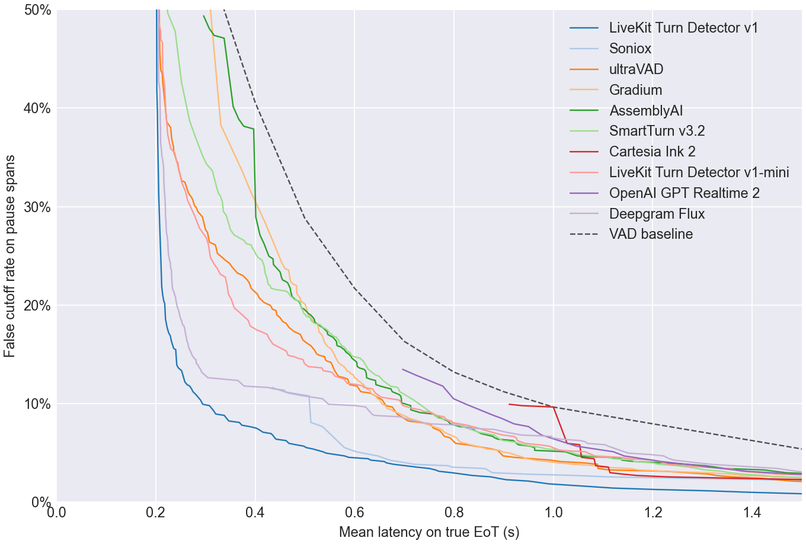
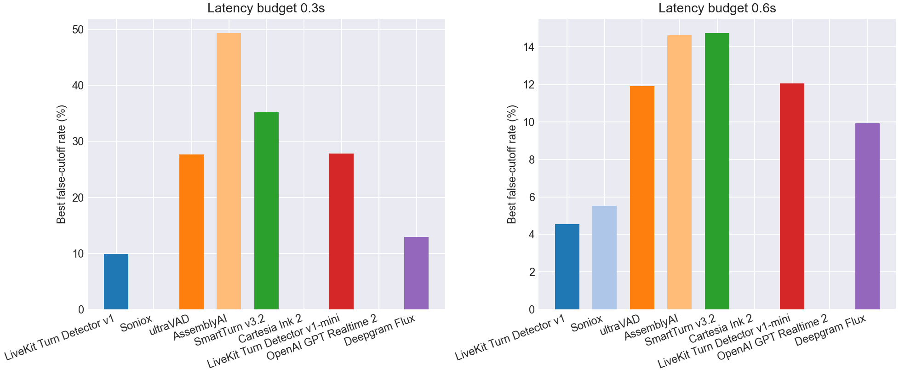
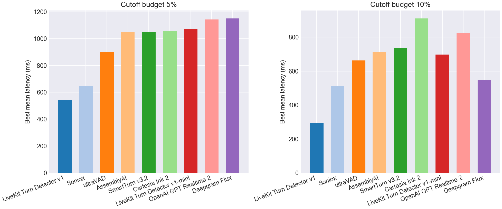

# EoT Model Comparison

## Pareto Frontier

## Best Cutoff Rate at Latency Budget

| Model | Best cutoff rate @ 0.3s latency | Best cutoff rate @ 0.6s latency |
| --- | --- | --- |
| LiveKit Turn Detector v1 | **9.9%** | **4.5%** |
| JoinIn AI Baton | 12.3% | 4.8% |
| Soniox | - | 5.5% |
| ultraVAD | 27.7% | 11.9% |
| Gradium | 55.6% | 12.6% |
| AssemblyAI | 49.4% | 14.6% |
| SmartTurn v3.2 | 35.2% | 14.8% |
| Cartesia Ink 2 | - | - |
| LiveKit Turn Detector v1-mini | 27.8% | 12.1% |
| VAP (silent agent) | 47.0% | 14.6% |
| OpenAI GPT Realtime 2 | - | - |
| Deepgram Flux | 12.9% | 9.9% |
| VAD baseline | 55.6% | 21.7% |

## Best Latency at Cutoff Budget

| Model | Best mean latency @ 5% cutoff | Best mean latency @ 10% cutoff |
| --- | --- | --- |
| LiveKit Turn Detector v1 | **543 ms** | **295 ms** |
| JoinIn AI Baton | 577 ms | 350 ms |
| Soniox | 647 ms | 512 ms |
| ultraVAD | 899 ms | 663 ms |
| Gradium | 913 ms | 656 ms |
| AssemblyAI | 1049 ms | 713 ms |
| SmartTurn v3.2 | 1051 ms | 739 ms |
| Cartesia Ink 2 | 1056 ms | 911 ms |
| LiveKit Turn Detector v1-mini | 1070 ms | 698 ms |
| VAP (silent agent) | 1131 ms | 749 ms |
| OpenAI GPT Realtime 2 | 1143 ms | 824 ms |
| Deepgram Flux | 1151 ms | 548 ms |
| VAD baseline | 1600 ms | 1000 ms |

## Operating Points

| Type | Budget | Model | Mean Latency | Cutoff | Detect | Threshold | Action Delay | Timeout |
| --- | --- | --- | --- | --- | --- | --- | --- | --- |
| Cutoff | 5.0% | LiveKit Turn Detector v1 | 0.543 | 5.0% | 91.0% | 0.720 | 0.300 | 3.000 |
| Cutoff | 5.0% | JoinIn AI Baton | 0.577 | 4.8% | 89.8% | 0.760 | 0.300 | 3.000 |
| Cutoff | 5.0% | Soniox | 0.647 | 4.7% | 86.5% | 0.990 | 0.200 | 2.500 |
| Cutoff | 5.0% | ultraVAD | 0.899 | 4.7% | 95.5% | 0.140 | 0.800 | 3.000 |
| Cutoff | 5.0% | Gradium | 0.913 | 5.0% | 90.0% | 0.560 | 0.600 | 2.000 |
| Cutoff | 5.0% | AssemblyAI | 1.049 | 4.7% | 93.5% | 0.560 | 0.900 | 3.000 |
| Cutoff | 5.0% | SmartTurn v3.2 | 1.051 | 4.8% | 84.8% | 0.090 | 0.700 | 3.000 |
| Cutoff | 5.0% | Cartesia Ink 2 | 1.056 | 4.5% | 94.2% | 0.990 | 0.200 | 2.000 |
| Cutoff | 5.0% | LiveKit Turn Detector v1-mini | 1.070 | 5.0% | 71.5% | 0.430 | 0.700 | 2.000 |
| Cutoff | 5.0% | VAP (silent agent) | 1.131 | 5.0% | 76.2% | 0.100 | 0.700 | 2.000 |
| Cutoff | 5.0% | OpenAI GPT Realtime 2 | 1.143 | 4.7% | 80.8% | 0.990 | 0.800 | 2.500 |
| Cutoff | 5.0% | Deepgram Flux | 1.151 | 5.0% | 50.7% | 0.790 | 0.300 | 2.000 |
| Cutoff | 10.0% | LiveKit Turn Detector v1 | 0.295 | 9.9% | 94.8% | 0.570 | 0.200 | 2.000 |
| Cutoff | 10.0% | JoinIn AI Baton | 0.350 | 9.4% | 93.5% | 0.630 | 0.200 | 2.500 |
| Cutoff | 10.0% | Soniox | 0.512 | 8.1% | 86.5% | 0.990 | 0.200 | 1.500 |
| Cutoff | 10.0% | ultraVAD | 0.663 | 9.8% | 95.5% | 0.140 | 0.600 | 2.000 |
| Cutoff | 10.0% | Gradium | 0.656 | 9.9% | 99.5% | 0.310 | 0.400 | 2.500 |
| Cutoff | 10.0% | AssemblyAI | 0.713 | 9.8% | 96.2% | 0.210 | 0.600 | 2.500 |
| Cutoff | 10.0% | SmartTurn v3.2 | 0.739 | 9.6% | 97.0% | 0.010 | 0.700 | 2.000 |
| Cutoff | 10.0% | Cartesia Ink 2 | 0.911 | 9.9% | 53.2% | 0.990 | 0.200 | 1.000 |
| Cutoff | 10.0% | LiveKit Turn Detector v1-mini | 0.698 | 9.8% | 80.2% | 0.360 | 0.500 | 1.500 |
| Cutoff | 10.0% | VAP (silent agent) | 0.749 | 9.8% | 99.0% | 0.040 | 0.700 | 2.000 |
| Cutoff | 10.0% | OpenAI GPT Realtime 2 | 0.824 | 9.9% | 80.8% | 0.990 | 0.600 | 1.500 |
| Cutoff | 10.0% | Deepgram Flux | 0.548 | 9.9% | 98.8% | 0.680 | 0.500 | 3.000 |
| Latency | 300ms | LiveKit Turn Detector v1 | 0.295 | 9.9% | 94.8% | 0.570 | 0.200 | 2.000 |
| Latency | 300ms | JoinIn AI Baton | 0.299 | 12.3% | 94.5% | 0.530 | 0.200 | 2.000 |
| Latency | 300ms | Soniox | - | - | - | - | - | - |
| Latency | 300ms | ultraVAD | 0.300 | 27.7% | 87.5% | 0.280 | 0.200 | 1.000 |
| Latency | 300ms | Gradium | 0.300 | 55.6% | 100.0% | 0.000 | 0.300 | 1.000 |
| Latency | 300ms | AssemblyAI | 0.296 | 49.4% | 97.5% | 0.000 | 0.200 | 1.000 |
| Latency | 300ms | SmartTurn v3.2 | 0.294 | 35.2% | 88.2% | 0.050 | 0.200 | 1.000 |
| Latency | 300ms | Cartesia Ink 2 | - | - | - | - | - | - |
| Latency | 300ms | LiveKit Turn Detector v1-mini | 0.288 | 27.8% | 89.0% | 0.250 | 0.200 | 1.000 |
| Latency | 300ms | VAP (silent agent) | 0.268 | 47.0% | 99.8% | 0.020 | 0.200 | 2.000 |
| Latency | 300ms | OpenAI GPT Realtime 2 | - | - | - | - | - | - |
| Latency | 300ms | Deepgram Flux | 0.298 | 12.9% | 98.8% | 0.700 | 0.200 | 2.500 |
| Latency | 600ms | LiveKit Turn Detector v1 | 0.588 | 4.5% | 91.0% | 0.720 | 0.300 | 3.500 |
| Latency | 600ms | JoinIn AI Baton | 0.577 | 4.8% | 89.8% | 0.760 | 0.300 | 3.000 |
| Latency | 600ms | Soniox | 0.580 | 5.5% | 86.5% | 0.990 | 0.200 | 2.000 |
| Latency | 600ms | ultraVAD | 0.590 | 11.9% | 95.5% | 0.140 | 0.500 | 2.500 |
| Latency | 600ms | Gradium | 0.600 | 12.6% | 99.8% | 0.200 | 0.500 | 2.500 |
| Latency | 600ms | AssemblyAI | 0.595 | 14.6% | 97.0% | 0.020 | 0.500 | 2.000 |
| Latency | 600ms | SmartTurn v3.2 | 0.599 | 14.8% | 80.2% | 0.210 | 0.500 | 1.000 |
| Latency | 600ms | Cartesia Ink 2 | - | - | - | - | - | - |
| Latency | 600ms | LiveKit Turn Detector v1-mini | 0.585 | 12.1% | 76.2% | 0.390 | 0.300 | 1.500 |
| Latency | 600ms | VAP (silent agent) | 0.589 | 14.6% | 99.0% | 0.040 | 0.500 | 2.000 |
| Latency | 600ms | OpenAI GPT Realtime 2 | - | - | - | - | - | - |
| Latency | 600ms | Deepgram Flux | 0.548 | 9.9% | 98.8% | 0.680 | 0.500 | 3.000 |
