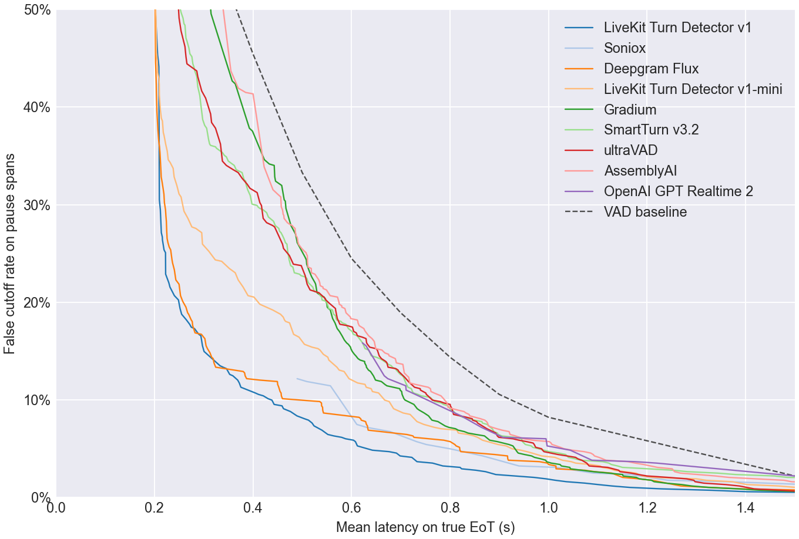
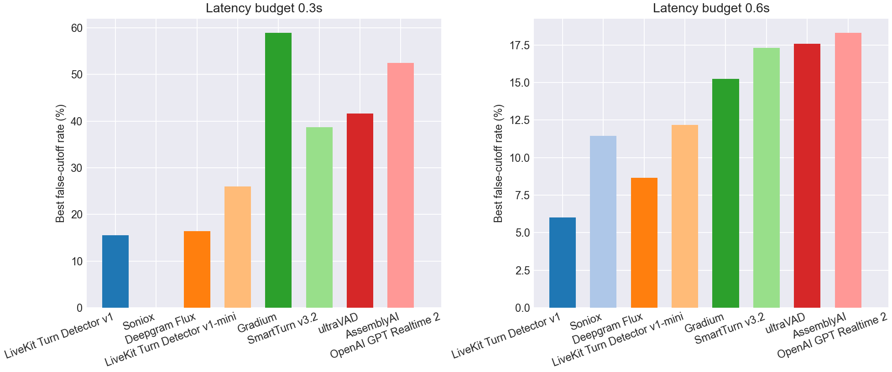
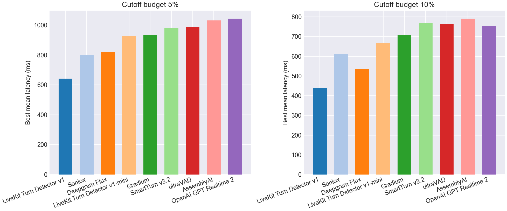

# EoT Model Comparison

## Pareto Frontier

## Best Cutoff Rate at Latency Budget

| Model | Best cutoff rate @ 0.3s latency | Best cutoff rate @ 0.6s latency |
| --- | --- | --- |
| LiveKit Turn Detector v1 | **15.5%** | **6.0%** |
| Soniox | - | 11.4% |
| Deepgram Flux | 16.4% | 8.7% |
| LiveKit Turn Detector v1-mini | 26.0% | 12.2% |
| Gradium | 58.9% | 15.2% |
| SmartTurn v3.2 | 38.7% | 17.3% |
| ultraVAD | 41.6% | 17.6% |
| AssemblyAI | 52.5% | 18.3% |
| OpenAI GPT Realtime 2 | - | - |
| VAD baseline | 58.9% | 24.5% |

## Best Latency at Cutoff Budget

| Model | Best mean latency @ 5% cutoff | Best mean latency @ 10% cutoff |
| --- | --- | --- |
| LiveKit Turn Detector v1 | **642 ms** | **438 ms** |
| Soniox | 800 ms | 611 ms |
| Deepgram Flux | 820 ms | 536 ms |
| LiveKit Turn Detector v1-mini | 926 ms | 667 ms |
| Gradium | 934 ms | 709 ms |
| SmartTurn v3.2 | 980 ms | 769 ms |
| ultraVAD | 986 ms | 764 ms |
| AssemblyAI | 1031 ms | 792 ms |
| OpenAI GPT Realtime 2 | 1044 ms | 755 ms |
| VAD baseline | 1200 ms | 1000 ms |

## Operating Points

| Type | Budget | Model | Mean Latency | Cutoff | Detect | Threshold | Action Delay | Timeout |
| --- | --- | --- | --- | --- | --- | --- | --- | --- |
| Cutoff | 5.0% | LiveKit Turn Detector v1 | 0.642 | 4.8% | 90.5% | 0.610 | 0.500 | 2.000 |
| Cutoff | 5.0% | Soniox | 0.800 | 5.0% | 75.8% | 0.990 | 0.400 | 2.000 |
| Cutoff | 5.0% | Deepgram Flux | 0.820 | 4.8% | 98.5% | 0.660 | 0.800 | 2.000 |
| Cutoff | 5.0% | LiveKit Turn Detector v1-mini | 0.926 | 5.0% | 89.5% | 0.360 | 0.800 | 2.000 |
| Cutoff | 5.0% | Gradium | 0.934 | 4.8% | 75.8% | 0.650 | 0.200 | 1.500 |
| Cutoff | 5.0% | SmartTurn v3.2 | 0.980 | 5.0% | 85.0% | 0.770 | 0.800 | 2.000 |
| Cutoff | 5.0% | ultraVAD | 0.986 | 5.0% | 84.5% | 0.210 | 0.800 | 2.000 |
| Cutoff | 5.0% | AssemblyAI | 1.031 | 5.0% | 89.2% | 0.300 | 0.900 | 2.000 |
| Cutoff | 5.0% | OpenAI GPT Realtime 2 | 1.044 | 4.8% | 91.2% | 0.990 | 1.000 | 1.500 |
| Cutoff | 10.0% | LiveKit Turn Detector v1 | 0.439 | 10.0% | 86.8% | 0.710 | 0.200 | 2.000 |
| Cutoff | 10.0% | Soniox | 0.611 | 7.5% | 75.8% | 0.990 | 0.200 | 1.500 |
| Cutoff | 10.0% | Deepgram Flux | 0.536 | 9.8% | 98.5% | 0.700 | 0.500 | 1.500 |
| Cutoff | 10.0% | LiveKit Turn Detector v1-mini | 0.667 | 10.0% | 92.5% | 0.330 | 0.600 | 1.500 |
| Cutoff | 10.0% | Gradium | 0.709 | 10.0% | 91.5% | 0.380 | 0.500 | 1.500 |
| Cutoff | 10.0% | SmartTurn v3.2 | 0.769 | 9.8% | 81.2% | 0.870 | 0.600 | 1.500 |
| Cutoff | 10.0% | ultraVAD | 0.764 | 10.0% | 81.8% | 0.250 | 0.600 | 1.500 |
| Cutoff | 10.0% | AssemblyAI | 0.792 | 9.8% | 91.5% | 0.030 | 0.700 | 1.500 |
| Cutoff | 10.0% | OpenAI GPT Realtime 2 | 0.755 | 10.0% | 91.2% | 0.990 | 0.600 | 2.000 |
| Latency | 300ms | LiveKit Turn Detector v1 | 0.297 | 15.5% | 92.5% | 0.540 | 0.200 | 1.500 |
| Latency | 300ms | Soniox | - | - | - | - | - | - |
| Latency | 300ms | Deepgram Flux | 0.300 | 16.4% | 98.5% | 0.610 | 0.200 | 2.000 |
| Latency | 300ms | LiveKit Turn Detector v1-mini | 0.297 | 26.0% | 92.5% | 0.330 | 0.200 | 1.500 |
| Latency | 300ms | Gradium | 0.300 | 58.9% | 100.0% | 0.000 | 0.300 | 1.000 |
| Latency | 300ms | SmartTurn v3.2 | 0.298 | 38.7% | 87.8% | 0.650 | 0.200 | 1.000 |
| Latency | 300ms | ultraVAD | 0.296 | 41.6% | 88.0% | 0.170 | 0.200 | 1.000 |
| Latency | 300ms | AssemblyAI | 0.294 | 52.5% | 97.0% | 0.000 | 0.200 | 1.000 |
| Latency | 300ms | OpenAI GPT Realtime 2 | - | - | - | - | - | - |
| Latency | 600ms | LiveKit Turn Detector v1 | 0.588 | 6.0% | 88.2% | 0.670 | 0.400 | 2.000 |
| Latency | 600ms | Soniox | 0.557 | 11.4% | 75.8% | 0.990 | 0.400 | 1.000 |
| Latency | 600ms | Deepgram Flux | 0.543 | 8.7% | 98.5% | 0.700 | 0.500 | 2.000 |
| Latency | 600ms | LiveKit Turn Detector v1-mini | 0.595 | 12.2% | 90.5% | 0.350 | 0.500 | 1.500 |
| Latency | 600ms | Gradium | 0.599 | 15.2% | 93.8% | 0.250 | 0.400 | 1.000 |
| Latency | 600ms | SmartTurn v3.2 | 0.594 | 17.3% | 81.2% | 0.870 | 0.500 | 1.000 |
| Latency | 600ms | ultraVAD | 0.592 | 17.6% | 58.2% | 0.460 | 0.300 | 1.000 |
| Latency | 600ms | AssemblyAI | 0.598 | 18.3% | 88.0% | 0.100 | 0.500 | 1.000 |
| Latency | 600ms | OpenAI GPT Realtime 2 | - | - | - | - | - | - |
