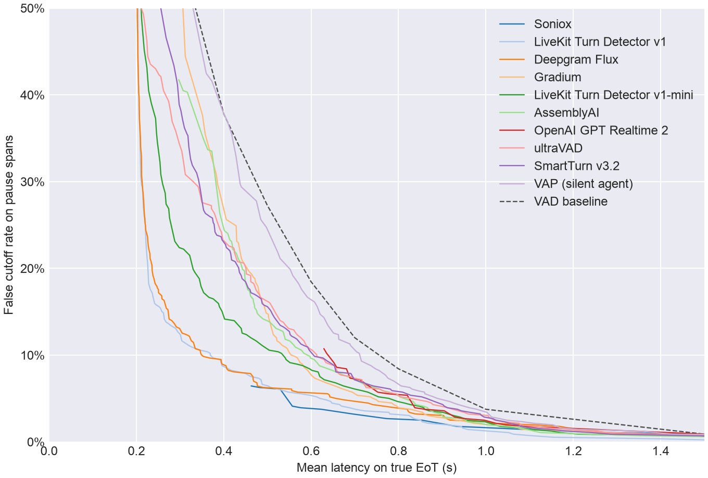
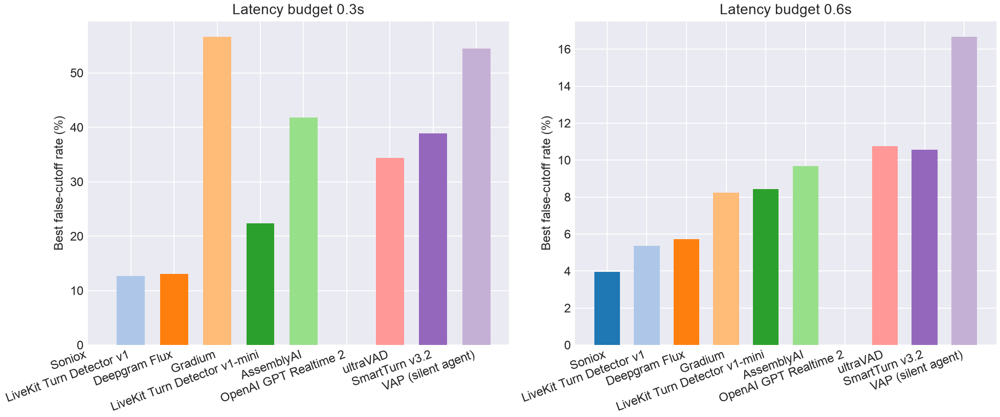
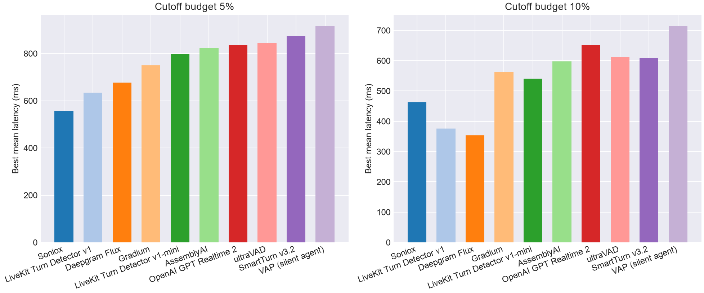

# EoT Model Comparison

## Pareto Frontier

## Best Cutoff Rate at Latency Budget

| Model | Best cutoff rate @ 0.3s latency | Best cutoff rate @ 0.6s latency |
| --- | --- | --- |
| Soniox | - | **3.9%** |
| LiveKit Turn Detector v1 | **12.7%** | 5.4% |
| Deepgram Flux | 13.1% | 5.7% |
| Gradium | 56.6% | 8.2% |
| LiveKit Turn Detector v1-mini | 22.4% | 8.4% |
| AssemblyAI | 41.8% | 9.7% |
| OpenAI GPT Realtime 2 | - | - |
| ultraVAD | 34.4% | 10.8% |
| SmartTurn v3.2 | 38.9% | 10.6% |
| VAP (silent agent) | 54.5% | 16.7% |
| VAD baseline | 56.6% | 18.5% |

## Best Latency at Cutoff Budget

| Model | Best mean latency @ 5% cutoff | Best mean latency @ 10% cutoff |
| --- | --- | --- |
| Soniox | **557 ms** | 463 ms |
| LiveKit Turn Detector v1 | 635 ms | 376 ms |
| Deepgram Flux | 676 ms | **353 ms** |
| Gradium | 750 ms | 563 ms |
| LiveKit Turn Detector v1-mini | 798 ms | 541 ms |
| AssemblyAI | 822 ms | 598 ms |
| OpenAI GPT Realtime 2 | 837 ms | 652 ms |
| ultraVAD | 846 ms | 613 ms |
| SmartTurn v3.2 | 873 ms | 608 ms |
| VAP (silent agent) | 917 ms | 715 ms |
| VAD baseline | 1000 ms | 800 ms |

## Operating Points

| Type | Budget | Model | Mean Latency | Cutoff | Detect | Threshold | Action Delay | Timeout |
| --- | --- | --- | --- | --- | --- | --- | --- | --- |
| Cutoff | 5.0% | Soniox | 0.557 | 4.1% | 81.2% | 0.990 | 0.200 | 1.500 |
| Cutoff | 5.0% | LiveKit Turn Detector v1 | 0.635 | 4.8% | 86.5% | 0.700 | 0.500 | 1.500 |
| Cutoff | 5.0% | Deepgram Flux | 0.676 | 4.8% | 78.0% | 0.730 | 0.400 | 1.500 |
| Cutoff | 5.0% | Gradium | 0.750 | 4.8% | 94.5% | 0.370 | 0.600 | 1.500 |
| Cutoff | 5.0% | LiveKit Turn Detector v1-mini | 0.798 | 4.7% | 78.0% | 0.380 | 0.600 | 1.500 |
| Cutoff | 5.0% | AssemblyAI | 0.822 | 4.8% | 87.2% | 0.630 | 0.700 | 1.500 |
| Cutoff | 5.0% | OpenAI GPT Realtime 2 | 0.837 | 3.9% | 95.5% | 0.990 | 0.800 | 1.500 |
| Cutoff | 5.0% | ultraVAD | 0.846 | 4.8% | 51.2% | 0.450 | 0.700 | 1.000 |
| Cutoff | 5.0% | SmartTurn v3.2 | 0.873 | 4.8% | 63.5% | 0.870 | 0.800 | 1.000 |
| Cutoff | 5.0% | VAP (silent agent) | 0.917 | 4.7% | 47.2% | 0.130 | 0.800 | 1.000 |
| Cutoff | 10.0% | Soniox | 0.463 | 6.5% | 80.8% | 0.990 | 0.200 | 1.000 |
| Cutoff | 10.0% | LiveKit Turn Detector v1 | 0.376 | 9.7% | 86.5% | 0.700 | 0.200 | 1.500 |
| Cutoff | 10.0% | Deepgram Flux | 0.353 | 9.9% | 97.2% | 0.700 | 0.200 | 1.500 |
| Cutoff | 10.0% | Gradium | 0.563 | 9.9% | 98.5% | 0.180 | 0.400 | 1.500 |
| Cutoff | 10.0% | LiveKit Turn Detector v1-mini | 0.541 | 9.7% | 76.5% | 0.390 | 0.400 | 1.000 |
| Cutoff | 10.0% | AssemblyAI | 0.598 | 9.9% | 77.0% | 0.740 | 0.400 | 1.000 |
| Cutoff | 10.0% | OpenAI GPT Realtime 2 | 0.652 | 9.1% | 95.5% | 0.990 | 0.200 | 1.500 |
| Cutoff | 10.0% | ultraVAD | 0.613 | 9.9% | 55.2% | 0.430 | 0.300 | 1.000 |
| Cutoff | 10.0% | SmartTurn v3.2 | 0.608 | 9.9% | 49.0% | 0.960 | 0.200 | 1.000 |
| Cutoff | 10.0% | VAP (silent agent) | 0.715 | 9.3% | 84.0% | 0.060 | 0.600 | 1.000 |
| Latency | 300ms | Soniox | - | - | - | - | - | - |
| Latency | 300ms | LiveKit Turn Detector v1 | 0.294 | 12.7% | 92.8% | 0.510 | 0.200 | 1.500 |
| Latency | 300ms | Deepgram Flux | 0.299 | 13.1% | 98.5% | 0.560 | 0.200 | 2.000 |
| Latency | 300ms | Gradium | 0.300 | 56.6% | 100.0% | 0.000 | 0.300 | 1.000 |
| Latency | 300ms | LiveKit Turn Detector v1-mini | 0.298 | 22.4% | 87.8% | 0.280 | 0.200 | 1.000 |
| Latency | 300ms | AssemblyAI | 0.297 | 41.8% | 98.0% | 0.000 | 0.200 | 1.000 |
| Latency | 300ms | OpenAI GPT Realtime 2 | - | - | - | - | - | - |
| Latency | 300ms | ultraVAD | 0.298 | 34.4% | 87.8% | 0.160 | 0.200 | 1.000 |
| Latency | 300ms | SmartTurn v3.2 | 0.298 | 38.9% | 87.8% | 0.060 | 0.200 | 1.000 |
| Latency | 300ms | VAP (silent agent) | 0.289 | 54.5% | 100.0% | 0.020 | 0.200 | 1.500 |
| Latency | 600ms | Soniox | 0.576 | 3.9% | 81.2% | 0.990 | 0.300 | 1.500 |
| Latency | 600ms | LiveKit Turn Detector v1 | 0.598 | 5.4% | 90.2% | 0.630 | 0.500 | 1.500 |
| Latency | 600ms | Deepgram Flux | 0.570 | 5.7% | 97.2% | 0.690 | 0.500 | 2.000 |
| Latency | 600ms | Gradium | 0.592 | 8.2% | 98.5% | 0.200 | 0.500 | 1.500 |
| Latency | 600ms | LiveKit Turn Detector v1-mini | 0.597 | 8.4% | 67.2% | 0.470 | 0.400 | 1.000 |
| Latency | 600ms | AssemblyAI | 0.598 | 9.7% | 77.0% | 0.750 | 0.400 | 1.000 |
| Latency | 600ms | OpenAI GPT Realtime 2 | - | - | - | - | - | - |
| Latency | 600ms | ultraVAD | 0.597 | 10.8% | 67.2% | 0.330 | 0.400 | 1.000 |
| Latency | 600ms | SmartTurn v3.2 | 0.596 | 10.6% | 57.8% | 0.920 | 0.300 | 1.000 |
| Latency | 600ms | VAP (silent agent) | 0.592 | 16.7% | 92.0% | 0.040 | 0.500 | 1.000 |
