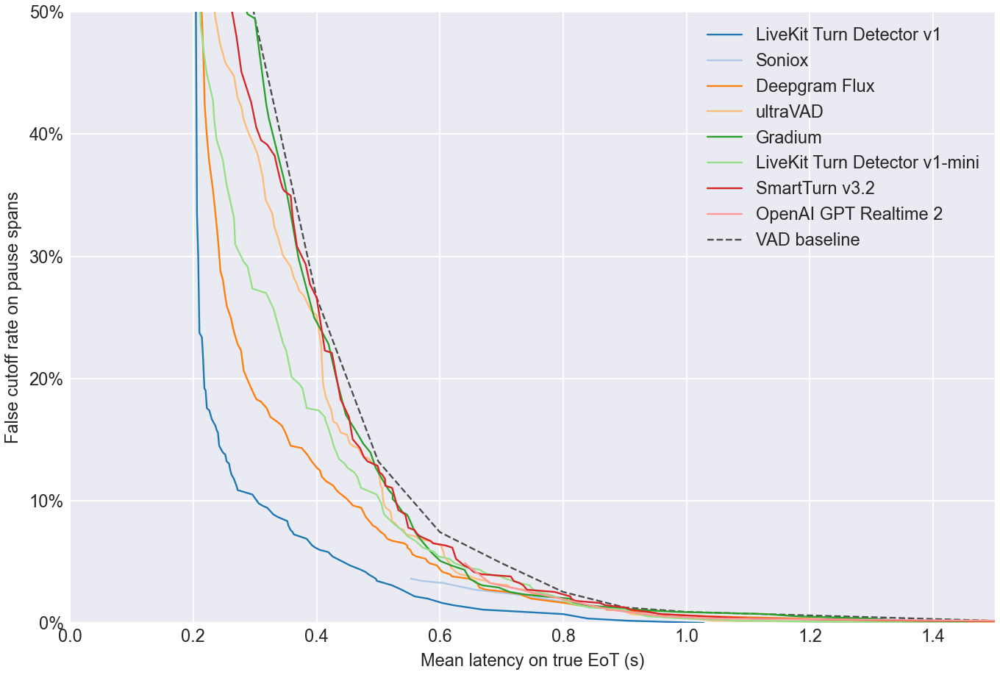
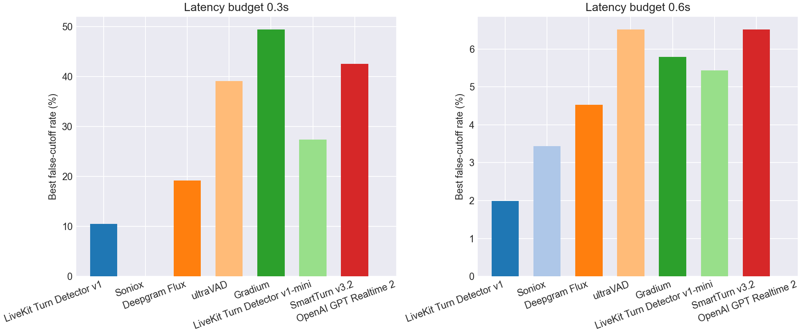
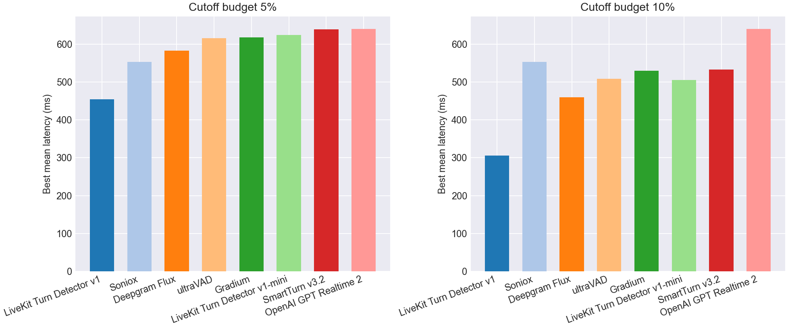

# EoT Model Comparison

## Pareto Frontier

## Best Cutoff Rate at Latency Budget

| Model | Best cutoff rate @ 0.3s latency | Best cutoff rate @ 0.6s latency |
| --- | --- | --- |
| LiveKit Turn Detector v1 | **10.5%** | **2.0%** |
| Soniox | - | 3.4% |
| Deepgram Flux | 19.2% | 4.5% |
| ultraVAD | 39.1% | 6.5% |
| Gradium | 49.5% | 5.8% |
| LiveKit Turn Detector v1-mini | 27.4% | 5.4% |
| SmartTurn v3.2 | 42.6% | 6.5% |
| OpenAI GPT Realtime 2 | - | - |
| VAD baseline | 49.5% | 7.4% |

## Best Latency at Cutoff Budget

| Model | Best mean latency @ 5% cutoff | Best mean latency @ 10% cutoff |
| --- | --- | --- |
| LiveKit Turn Detector v1 | **454 ms** | **306 ms** |
| Soniox | 553 ms | 553 ms |
| Deepgram Flux | 583 ms | 459 ms |
| ultraVAD | 616 ms | 509 ms |
| Gradium | 618 ms | 530 ms |
| LiveKit Turn Detector v1-mini | 624 ms | 505 ms |
| SmartTurn v3.2 | 639 ms | 532 ms |
| OpenAI GPT Realtime 2 | 641 ms | 641 ms |
| VAD baseline | 700 ms | 600 ms |

## Operating Points

| Type | Budget | Model | Mean Latency | Cutoff | Detect | Threshold | Action Delay | Timeout |
| --- | --- | --- | --- | --- | --- | --- | --- | --- |
| Cutoff | 5.0% | LiveKit Turn Detector v1 | 0.454 | 4.7% | 68.2% | 0.880 | 0.200 | 1.000 |
| Cutoff | 5.0% | Soniox | 0.553 | 3.6% | 70.5% | 0.990 | 0.200 | 1.000 |
| Cutoff | 5.0% | Deepgram Flux | 0.583 | 4.9% | 87.5% | 0.610 | 0.400 | 1.000 |
| Cutoff | 5.0% | ultraVAD | 0.616 | 4.9% | 98.2% | 0.060 | 0.600 | 1.500 |
| Cutoff | 5.0% | Gradium | 0.618 | 4.7% | 91.2% | 0.190 | 0.500 | 1.000 |
| Cutoff | 5.0% | LiveKit Turn Detector v1-mini | 0.624 | 4.9% | 75.2% | 0.360 | 0.500 | 1.000 |
| Cutoff | 5.0% | SmartTurn v3.2 | 0.639 | 4.7% | 90.2% | 0.040 | 0.600 | 1.000 |
| Cutoff | 5.0% | OpenAI GPT Realtime 2 | 0.641 | 4.9% | 89.8% | 0.990 | 0.200 | 1.000 |
| Cutoff | 10.0% | LiveKit Turn Detector v1 | 0.306 | 9.8% | 86.8% | 0.720 | 0.200 | 1.000 |
| Cutoff | 10.0% | Soniox | 0.553 | 3.6% | 70.5% | 0.990 | 0.200 | 1.000 |
| Cutoff | 10.0% | Deepgram Flux | 0.459 | 9.6% | 92.5% | 0.470 | 0.200 | 1.000 |
| Cutoff | 10.0% | ultraVAD | 0.509 | 9.8% | 98.2% | 0.060 | 0.500 | 1.000 |
| Cutoff | 10.0% | Gradium | 0.530 | 9.8% | 95.5% | 0.120 | 0.400 | 1.000 |
| Cutoff | 10.0% | LiveKit Turn Detector v1-mini | 0.505 | 9.8% | 82.5% | 0.300 | 0.400 | 1.000 |
| Cutoff | 10.0% | SmartTurn v3.2 | 0.532 | 9.2% | 93.5% | 0.020 | 0.500 | 1.000 |
| Cutoff | 10.0% | OpenAI GPT Realtime 2 | 0.641 | 4.9% | 89.8% | 0.990 | 0.200 | 1.000 |
| Latency | 300ms | LiveKit Turn Detector v1 | 0.296 | 10.5% | 88.0% | 0.700 | 0.200 | 1.000 |
| Latency | 300ms | Soniox | - | - | - | - | - | - |
| Latency | 300ms | Deepgram Flux | 0.294 | 19.2% | 97.8% | 0.240 | 0.200 | 1.000 |
| Latency | 300ms | ultraVAD | 0.298 | 39.1% | 87.8% | 0.170 | 0.200 | 1.000 |
| Latency | 300ms | Gradium | 0.300 | 49.5% | 100.0% | 0.000 | 0.300 | 1.000 |
| Latency | 300ms | LiveKit Turn Detector v1-mini | 0.296 | 27.4% | 88.0% | 0.270 | 0.200 | 1.000 |
| Latency | 300ms | SmartTurn v3.2 | 0.294 | 42.6% | 88.2% | 0.050 | 0.200 | 1.000 |
| Latency | 300ms | OpenAI GPT Realtime 2 | - | - | - | - | - | - |
| Latency | 600ms | LiveKit Turn Detector v1 | 0.580 | 2.0% | 70.0% | 0.870 | 0.400 | 1.000 |
| Latency | 600ms | Soniox | 0.570 | 3.4% | 70.5% | 0.990 | 0.300 | 1.000 |
| Latency | 600ms | Deepgram Flux | 0.598 | 4.5% | 89.5% | 0.550 | 0.500 | 1.000 |
| Latency | 600ms | ultraVAD | 0.590 | 6.5% | 91.0% | 0.130 | 0.500 | 1.500 |
| Latency | 600ms | Gradium | 0.586 | 5.8% | 93.8% | 0.150 | 0.500 | 1.000 |
| Latency | 600ms | LiveKit Turn Detector v1-mini | 0.598 | 5.4% | 80.5% | 0.320 | 0.500 | 1.000 |
| Latency | 600ms | SmartTurn v3.2 | 0.589 | 6.5% | 82.2% | 0.110 | 0.500 | 1.000 |
| Latency | 600ms | OpenAI GPT Realtime 2 | - | - | - | - | - | - |
