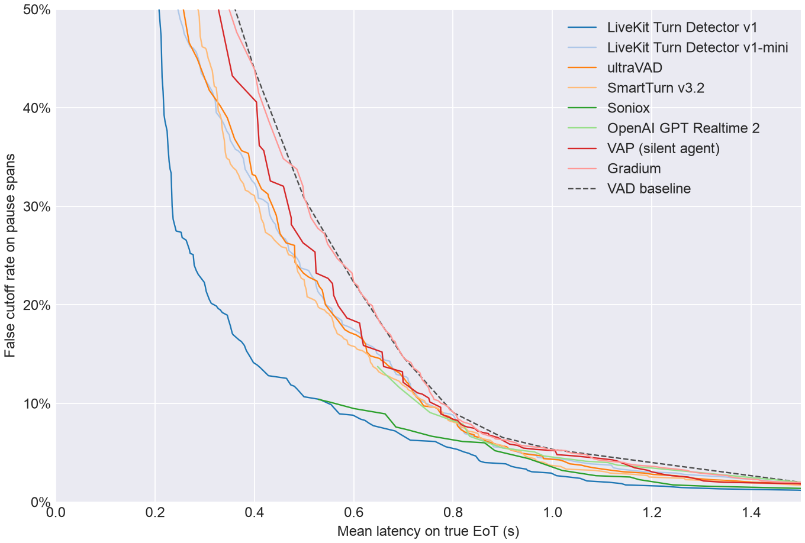
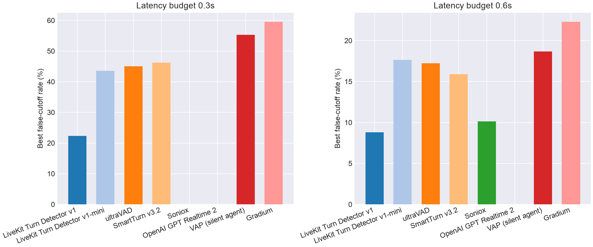
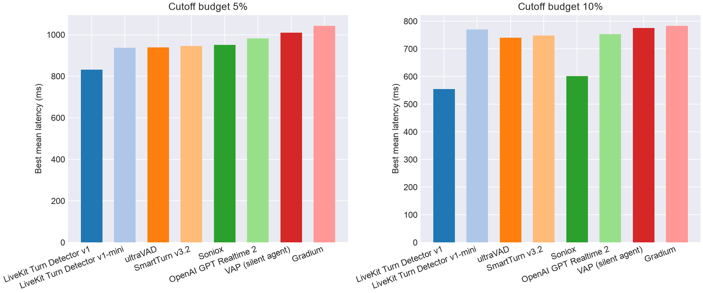

# EoT Model Comparison

## Pareto Frontier

## Best Cutoff Rate at Latency Budget

| Model | Best cutoff rate @ 0.3s latency | Best cutoff rate @ 0.6s latency |
| --- | --- | --- |
| LiveKit Turn Detector v1 | **22.3%** | **8.8%** |
| LiveKit Turn Detector v1-mini | 43.5% | 17.6% |
| ultraVAD | 45.0% | 17.2% |
| SmartTurn v3.2 | 46.2% | 15.9% |
| Soniox | - | 10.1% |
| OpenAI GPT Realtime 2 | - | - |
| VAP (silent agent) | 55.3% | 18.7% |
| Gradium | 59.5% | 22.3% |
| VAD baseline | 59.5% | 22.3% |

## Best Latency at Cutoff Budget

| Model | Best mean latency @ 5% cutoff | Best mean latency @ 10% cutoff |
| --- | --- | --- |
| LiveKit Turn Detector v1 | **832 ms** | **555 ms** |
| LiveKit Turn Detector v1-mini | 938 ms | 770 ms |
| ultraVAD | 939 ms | 741 ms |
| SmartTurn v3.2 | 945 ms | 748 ms |
| Soniox | 952 ms | 601 ms |
| OpenAI GPT Realtime 2 | 982 ms | 753 ms |
| VAP (silent agent) | 1009 ms | 775 ms |
| Gradium | 1042 ms | 783 ms |
| VAD baseline | 1100 ms | 800 ms |

## Operating Points

| Type | Budget | Model | Mean Latency | Cutoff | Detect | Threshold | Action Delay | Timeout |
| --- | --- | --- | --- | --- | --- | --- | --- | --- |
| Cutoff | 5.0% | LiveKit Turn Detector v1 | 0.832 | 4.9% | 95.5% | 0.300 | 0.800 | 1.500 |
| Cutoff | 5.0% | LiveKit Turn Detector v1-mini | 0.938 | 4.9% | 93.7% | 0.260 | 0.900 | 1.500 |
| Cutoff | 5.0% | ultraVAD | 0.939 | 4.9% | 96.5% | 0.030 | 0.900 | 2.000 |
| Cutoff | 5.0% | SmartTurn v3.2 | 0.945 | 4.7% | 92.4% | 0.050 | 0.900 | 1.500 |
| Cutoff | 5.0% | Soniox | 0.952 | 4.4% | 68.9% | 0.990 | 0.700 | 1.500 |
| Cutoff | 5.0% | OpenAI GPT Realtime 2 | 0.982 | 4.7% | 87.1% | 0.990 | 0.900 | 1.500 |
| Cutoff | 5.0% | VAP (silent agent) | 1.009 | 4.8% | 98.7% | 0.030 | 1.000 | 1.500 |
| Cutoff | 5.0% | Gradium | 1.042 | 4.9% | 72.7% | 0.390 | 0.800 | 1.500 |
| Cutoff | 10.0% | LiveKit Turn Detector v1 | 0.555 | 9.9% | 74.2% | 0.770 | 0.400 | 1.000 |
| Cutoff | 10.0% | LiveKit Turn Detector v1-mini | 0.770 | 9.5% | 76.8% | 0.440 | 0.700 | 1.000 |
| Cutoff | 10.0% | ultraVAD | 0.741 | 9.7% | 86.4% | 0.080 | 0.700 | 1.000 |
| Cutoff | 10.0% | SmartTurn v3.2 | 0.748 | 9.9% | 84.1% | 0.320 | 0.700 | 1.000 |
| Cutoff | 10.0% | Soniox | 0.601 | 9.5% | 68.7% | 0.990 | 0.400 | 1.000 |
| Cutoff | 10.0% | OpenAI GPT Realtime 2 | 0.753 | 9.1% | 86.1% | 0.990 | 0.700 | 1.000 |
| Cutoff | 10.0% | VAP (silent agent) | 0.775 | 9.6% | 62.1% | 0.100 | 0.500 | 1.000 |
| Cutoff | 10.0% | Gradium | 0.783 | 9.9% | 81.6% | 0.250 | 0.700 | 1.000 |
| Latency | 300ms | LiveKit Turn Detector v1 | 0.299 | 22.3% | 87.6% | 0.500 | 0.200 | 1.000 |
| Latency | 300ms | LiveKit Turn Detector v1-mini | 0.293 | 43.5% | 88.4% | 0.330 | 0.200 | 1.000 |
| Latency | 300ms | ultraVAD | 0.285 | 45.0% | 89.4% | 0.070 | 0.200 | 1.000 |
| Latency | 300ms | SmartTurn v3.2 | 0.295 | 46.2% | 88.1% | 0.170 | 0.200 | 1.000 |
| Latency | 300ms | Soniox | - | - | - | - | - | - |
| Latency | 300ms | OpenAI GPT Realtime 2 | - | - | - | - | - | - |
| Latency | 300ms | VAP (silent agent) | 0.291 | 55.3% | 99.0% | 0.020 | 0.200 | 1.500 |
| Latency | 300ms | Gradium | 0.300 | 59.5% | 100.0% | 0.000 | 0.300 | 1.000 |
| Latency | 600ms | LiveKit Turn Detector v1 | 0.598 | 8.8% | 66.9% | 0.810 | 0.400 | 1.000 |
| Latency | 600ms | LiveKit Turn Detector v1-mini | 0.596 | 17.6% | 80.8% | 0.400 | 0.500 | 1.000 |
| Latency | 600ms | ultraVAD | 0.591 | 17.2% | 81.8% | 0.100 | 0.500 | 1.000 |
| Latency | 600ms | SmartTurn v3.2 | 0.593 | 15.9% | 81.3% | 0.520 | 0.500 | 1.000 |
| Latency | 600ms | Soniox | 0.551 | 10.1% | 68.7% | 0.990 | 0.300 | 1.000 |
| Latency | 600ms | OpenAI GPT Realtime 2 | - | - | - | - | - | - |
| Latency | 600ms | VAP (silent agent) | 0.585 | 18.7% | 92.2% | 0.040 | 0.500 | 1.000 |
| Latency | 600ms | Gradium | 0.600 | 22.3% | 100.0% | 0.000 | 0.600 | 1.000 |
