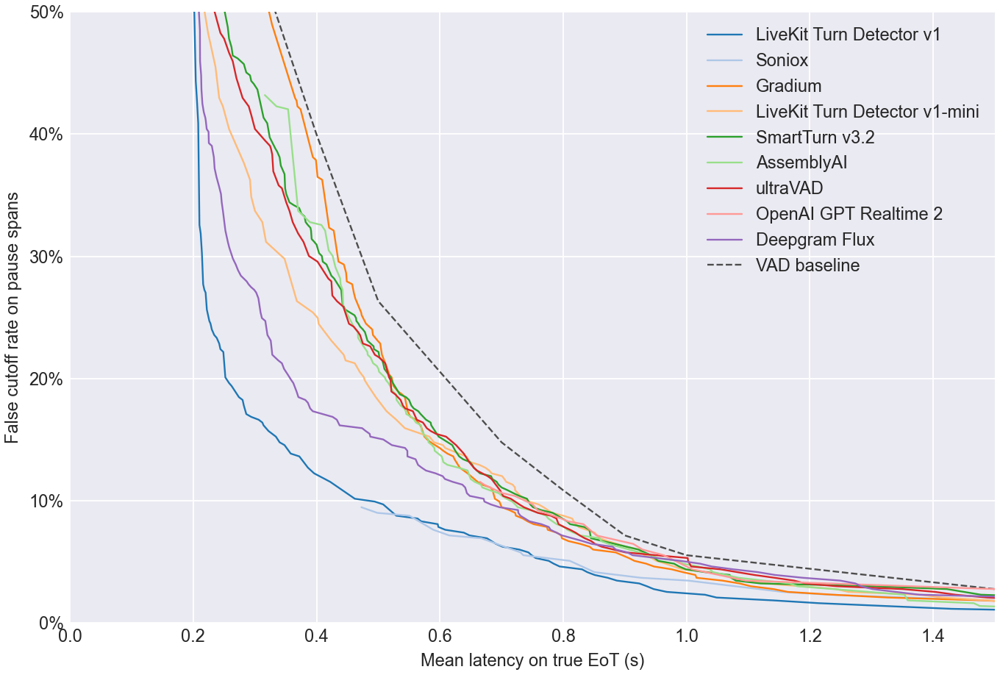
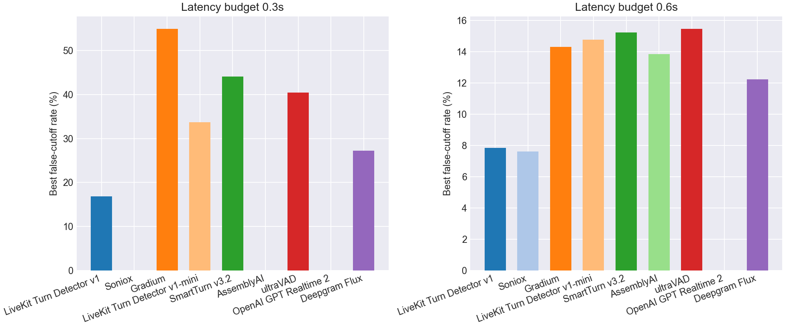
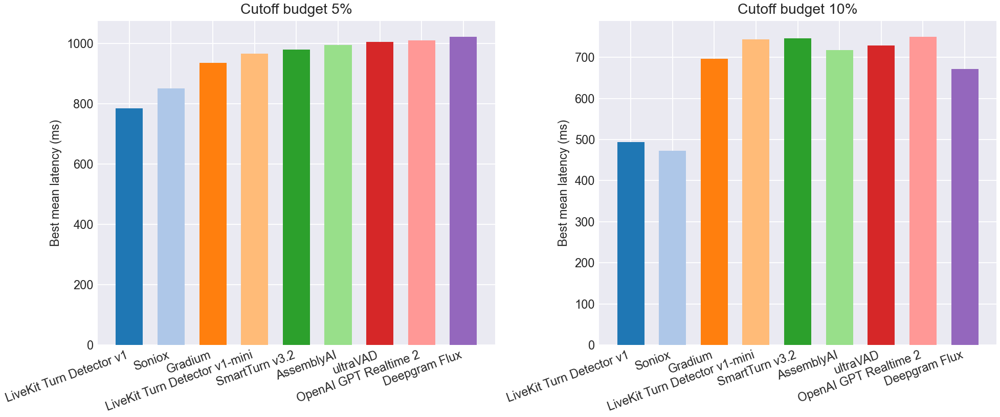

# EoT Model Comparison

## Pareto Frontier

## Best Cutoff Rate at Latency Budget

| Model | Best cutoff rate @ 0.3s latency | Best cutoff rate @ 0.6s latency |
| --- | --- | --- |
| LiveKit Turn Detector v1 | **16.9%** | 7.9% |
| Soniox | - | **7.6%** |
| Gradium | 55.0% | 14.3% |
| LiveKit Turn Detector v1-mini | 33.7% | 14.8% |
| SmartTurn v3.2 | 44.1% | 15.2% |
| AssemblyAI | - | 13.9% |
| ultraVAD | 40.4% | 15.5% |
| OpenAI GPT Realtime 2 | - | - |
| Deepgram Flux | 27.3% | 12.2% |
| VAD baseline | 55.0% | 20.6% |

## Best Latency at Cutoff Budget

| Model | Best mean latency @ 5% cutoff | Best mean latency @ 10% cutoff |
| --- | --- | --- |
| LiveKit Turn Detector v1 | **784 ms** | 494 ms |
| Soniox | 851 ms | **473 ms** |
| Gradium | 935 ms | 696 ms |
| LiveKit Turn Detector v1-mini | 966 ms | 744 ms |
| SmartTurn v3.2 | 980 ms | 746 ms |
| AssemblyAI | 994 ms | 717 ms |
| ultraVAD | 1005 ms | 729 ms |
| OpenAI GPT Realtime 2 | 1009 ms | 751 ms |
| Deepgram Flux | 1022 ms | 672 ms |
| VAD baseline | 1100 ms | 900 ms |

## Operating Points

| Type | Budget | Model | Mean Latency | Cutoff | Detect | Threshold | Action Delay | Timeout |
| --- | --- | --- | --- | --- | --- | --- | --- | --- |
| Cutoff | 5.0% | LiveKit Turn Detector v1 | 0.784 | 4.8% | 93.5% | 0.640 | 0.700 | 2.000 |
| Cutoff | 5.0% | Soniox | 0.851 | 4.2% | 77.0% | 0.990 | 0.500 | 2.000 |
| Cutoff | 5.0% | Gradium | 0.935 | 4.8% | 76.0% | 0.510 | 0.600 | 1.500 |
| Cutoff | 5.0% | LiveKit Turn Detector v1-mini | 0.966 | 4.8% | 94.0% | 0.180 | 0.900 | 2.000 |
| Cutoff | 5.0% | SmartTurn v3.2 | 0.980 | 4.8% | 92.8% | 0.050 | 0.900 | 2.000 |
| Cutoff | 5.0% | AssemblyAI | 0.994 | 4.8% | 91.8% | 0.020 | 0.900 | 2.000 |
| Cutoff | 5.0% | ultraVAD | 1.005 | 4.8% | 99.5% | 0.010 | 1.000 | 2.000 |
| Cutoff | 5.0% | OpenAI GPT Realtime 2 | 1.009 | 4.4% | 90.8% | 0.990 | 0.900 | 2.000 |
| Cutoff | 5.0% | Deepgram Flux | 1.022 | 4.8% | 95.8% | 0.520 | 1.000 | 1.500 |
| Cutoff | 10.0% | LiveKit Turn Detector v1 | 0.494 | 9.9% | 72.2% | 0.930 | 0.300 | 1.000 |
| Cutoff | 10.0% | Soniox | 0.473 | 9.5% | 76.5% | 0.990 | 0.200 | 1.000 |
| Cutoff | 10.0% | Gradium | 0.696 | 9.9% | 83.8% | 0.370 | 0.500 | 1.000 |
| Cutoff | 10.0% | LiveKit Turn Detector v1-mini | 0.744 | 9.9% | 85.2% | 0.260 | 0.700 | 1.000 |
| Cutoff | 10.0% | SmartTurn v3.2 | 0.746 | 9.7% | 84.5% | 0.260 | 0.700 | 1.000 |
| Cutoff | 10.0% | AssemblyAI | 0.717 | 9.9% | 74.2% | 0.650 | 0.600 | 1.000 |
| Cutoff | 10.0% | ultraVAD | 0.729 | 9.7% | 54.2% | 0.430 | 0.500 | 1.000 |
| Cutoff | 10.0% | OpenAI GPT Realtime 2 | 0.751 | 9.7% | 90.8% | 0.990 | 0.600 | 1.500 |
| Cutoff | 10.0% | Deepgram Flux | 0.672 | 9.9% | 94.5% | 0.640 | 0.600 | 1.500 |
| Latency | 300ms | LiveKit Turn Detector v1 | 0.294 | 16.9% | 88.2% | 0.790 | 0.200 | 1.000 |
| Latency | 300ms | Soniox | - | - | - | - | - | - |
| Latency | 300ms | Gradium | 0.300 | 55.0% | 100.0% | 0.000 | 0.300 | 1.000 |
| Latency | 300ms | LiveKit Turn Detector v1-mini | 0.300 | 33.7% | 87.5% | 0.240 | 0.200 | 1.000 |
| Latency | 300ms | SmartTurn v3.2 | 0.298 | 44.1% | 87.8% | 0.140 | 0.200 | 1.000 |
| Latency | 300ms | AssemblyAI | - | - | - | - | - | - |
| Latency | 300ms | ultraVAD | 0.300 | 40.4% | 87.5% | 0.170 | 0.200 | 1.000 |
| Latency | 300ms | OpenAI GPT Realtime 2 | - | - | - | - | - | - |
| Latency | 300ms | Deepgram Flux | 0.299 | 27.3% | 96.0% | 0.470 | 0.200 | 1.000 |
| Latency | 600ms | LiveKit Turn Detector v1 | 0.598 | 7.9% | 93.5% | 0.640 | 0.500 | 2.000 |
| Latency | 600ms | Soniox | 0.589 | 7.6% | 76.8% | 0.990 | 0.200 | 1.500 |
| Latency | 600ms | Gradium | 0.600 | 14.3% | 95.2% | 0.170 | 0.500 | 1.500 |
| Latency | 600ms | LiveKit Turn Detector v1-mini | 0.591 | 14.8% | 58.5% | 0.390 | 0.300 | 1.000 |
| Latency | 600ms | SmartTurn v3.2 | 0.598 | 15.2% | 67.0% | 0.890 | 0.400 | 1.000 |
| Latency | 600ms | AssemblyAI | 0.597 | 13.9% | 86.2% | 0.220 | 0.500 | 1.000 |
| Latency | 600ms | ultraVAD | 0.594 | 15.5% | 81.2% | 0.220 | 0.500 | 1.000 |
| Latency | 600ms | OpenAI GPT Realtime 2 | - | - | - | - | - | - |
| Latency | 600ms | Deepgram Flux | 0.593 | 12.2% | 94.5% | 0.640 | 0.500 | 1.500 |
