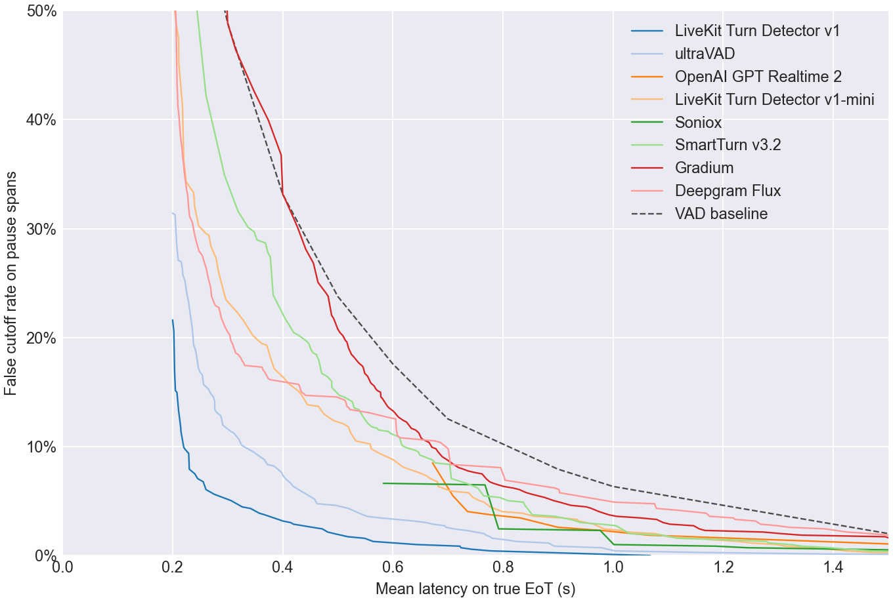
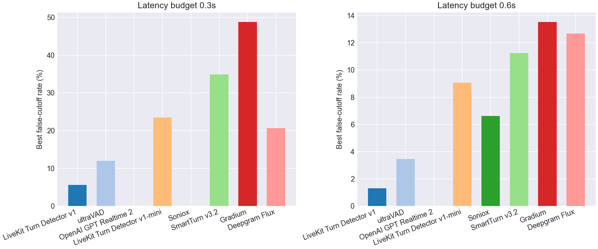
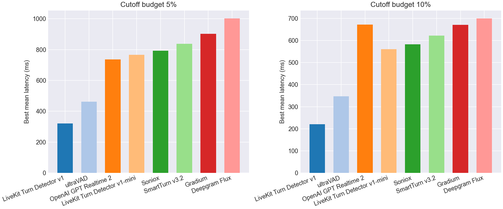

# EoT Model Comparison

## Pareto Frontier

## Best Cutoff Rate at Latency Budget

| Model | Best cutoff rate @ 0.3s latency | Best cutoff rate @ 0.6s latency |
| --- | --- | --- |
| LiveKit Turn Detector v1 | **5.6%** | **1.3%** |
| ultraVAD | 12.0% | 3.5% |
| OpenAI GPT Realtime 2 | - | - |
| LiveKit Turn Detector v1-mini | 23.5% | 9.1% |
| Soniox | - | 6.6% |
| SmartTurn v3.2 | 34.9% | 11.2% |
| Gradium | 48.8% | 13.5% |
| Deepgram Flux | 20.6% | 12.7% |
| VAD baseline | 48.8% | 17.6% |

## Best Latency at Cutoff Budget

| Model | Best mean latency @ 5% cutoff | Best mean latency @ 10% cutoff |
| --- | --- | --- |
| LiveKit Turn Detector v1 | **321 ms** | **220 ms** |
| ultraVAD | 462 ms | 347 ms |
| OpenAI GPT Realtime 2 | 736 ms | 672 ms |
| LiveKit Turn Detector v1-mini | 766 ms | 561 ms |
| Soniox | 792 ms | 583 ms |
| SmartTurn v3.2 | 837 ms | 622 ms |
| Gradium | 903 ms | 671 ms |
| Deepgram Flux | 1003 ms | 701 ms |
| VAD baseline | 1200 ms | 900 ms |

## Operating Points

| Type | Budget | Model | Mean Latency | Cutoff | Detect | Threshold | Action Delay | Timeout |
| --- | --- | --- | --- | --- | --- | --- | --- | --- |
| Cutoff | 5.0% | LiveKit Turn Detector v1 | 0.321 | 4.6% | 93.3% | 0.590 | 0.200 | 2.000 |
| Cutoff | 5.0% | ultraVAD | 0.462 | 4.8% | 90.4% | 0.260 | 0.300 | 2.000 |
| Cutoff | 5.0% | OpenAI GPT Realtime 2 | 0.736 | 4.0% | 94.7% | 0.990 | 0.200 | 2.000 |
| Cutoff | 5.0% | LiveKit Turn Detector v1-mini | 0.766 | 4.9% | 94.9% | 0.180 | 0.700 | 2.000 |
| Cutoff | 5.0% | Soniox | 0.792 | 2.4% | 58.1% | 0.990 | 0.200 | 1.500 |
| Cutoff | 5.0% | SmartTurn v3.2 | 0.837 | 4.9% | 82.9% | 0.040 | 0.700 | 1.500 |
| Cutoff | 5.0% | Gradium | 0.903 | 4.9% | 91.9% | 0.330 | 0.700 | 2.000 |
| Cutoff | 5.0% | Deepgram Flux | 1.003 | 4.9% | 99.7% | 0.670 | 1.000 | 2.000 |
| Cutoff | 10.0% | LiveKit Turn Detector v1 | 0.220 | 9.9% | 98.9% | 0.220 | 0.200 | 2.000 |
| Cutoff | 10.0% | ultraVAD | 0.347 | 9.5% | 91.9% | 0.230 | 0.200 | 2.000 |
| Cutoff | 10.0% | OpenAI GPT Realtime 2 | 0.672 | 8.5% | 90.2% | 0.990 | 0.200 | 1.000 |
| Cutoff | 10.0% | LiveKit Turn Detector v1-mini | 0.561 | 9.8% | 85.4% | 0.260 | 0.400 | 1.500 |
| Cutoff | 10.0% | Soniox | 0.583 | 6.6% | 58.1% | 0.990 | 0.200 | 1.000 |
| Cutoff | 10.0% | SmartTurn v3.2 | 0.622 | 9.9% | 62.9% | 0.680 | 0.400 | 1.000 |
| Cutoff | 10.0% | Gradium | 0.671 | 9.9% | 98.3% | 0.180 | 0.600 | 1.500 |
| Cutoff | 10.0% | Deepgram Flux | 0.701 | 9.8% | 100.0% | 0.570 | 0.700 | 1.500 |
| Latency | 300ms | LiveKit Turn Detector v1 | 0.276 | 5.6% | 95.8% | 0.480 | 0.200 | 2.000 |
| Latency | 300ms | ultraVAD | 0.291 | 12.0% | 93.0% | 0.220 | 0.200 | 1.500 |
| Latency | 300ms | OpenAI GPT Realtime 2 | - | - | - | - | - | - |
| Latency | 300ms | LiveKit Turn Detector v1-mini | 0.297 | 23.5% | 87.9% | 0.250 | 0.200 | 1.000 |
| Latency | 300ms | Soniox | - | - | - | - | - | - |
| Latency | 300ms | SmartTurn v3.2 | 0.294 | 34.9% | 88.2% | 0.020 | 0.200 | 1.000 |
| Latency | 300ms | Gradium | 0.300 | 48.8% | 100.0% | 0.000 | 0.300 | 1.000 |
| Latency | 300ms | Deepgram Flux | 0.299 | 20.6% | 99.7% | 0.620 | 0.200 | 1.500 |
| Latency | 600ms | LiveKit Turn Detector v1 | 0.564 | 1.3% | 79.8% | 0.860 | 0.200 | 2.000 |
| Latency | 600ms | ultraVAD | 0.577 | 3.5% | 83.7% | 0.320 | 0.300 | 2.000 |
| Latency | 600ms | OpenAI GPT Realtime 2 | - | - | - | - | - | - |
| Latency | 600ms | LiveKit Turn Detector v1-mini | 0.588 | 9.1% | 94.1% | 0.190 | 0.500 | 2.000 |
| Latency | 600ms | Soniox | 0.583 | 6.6% | 58.1% | 0.990 | 0.200 | 1.000 |
| Latency | 600ms | SmartTurn v3.2 | 0.595 | 11.2% | 57.9% | 0.840 | 0.300 | 1.000 |
| Latency | 600ms | Gradium | 0.593 | 13.5% | 99.4% | 0.140 | 0.500 | 2.000 |
| Latency | 600ms | Deepgram Flux | 0.591 | 12.7% | 92.1% | 0.710 | 0.500 | 1.500 |
