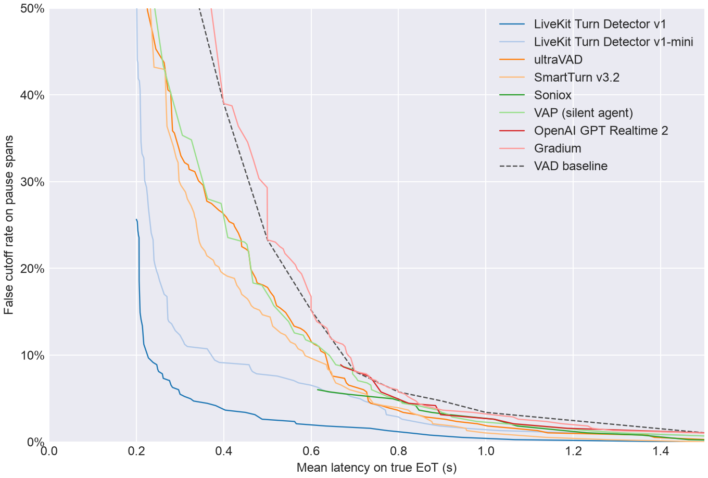
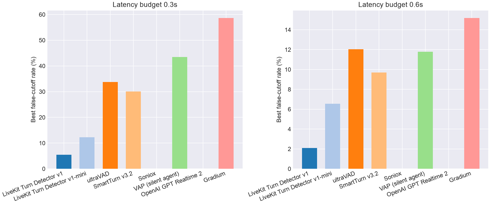
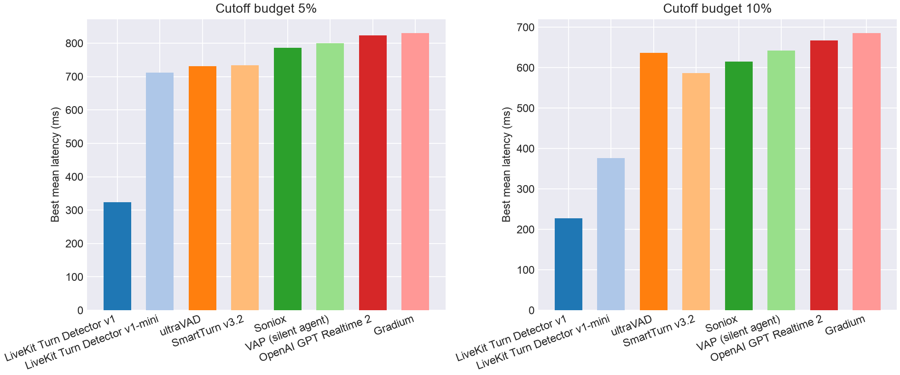

# EoT Model Comparison

## Pareto Frontier

## Best Cutoff Rate at Latency Budget

| Model | Best cutoff rate @ 0.3s latency | Best cutoff rate @ 0.6s latency |
| --- | --- | --- |
| LiveKit Turn Detector v1 | **5.5%** | **2.1%** |
| LiveKit Turn Detector v1-mini | 12.3% | 6.5% |
| ultraVAD | 33.8% | 12.0% |
| SmartTurn v3.2 | 30.1% | 9.7% |
| Soniox | - | - |
| VAP (silent agent) | 43.5% | 11.8% |
| OpenAI GPT Realtime 2 | - | - |
| Gradium | 58.6% | 15.2% |
| VAD baseline | 58.6% | 15.2% |

## Best Latency at Cutoff Budget

| Model | Best mean latency @ 5% cutoff | Best mean latency @ 10% cutoff |
| --- | --- | --- |
| LiveKit Turn Detector v1 | **324 ms** | **228 ms** |
| LiveKit Turn Detector v1-mini | 712 ms | 376 ms |
| ultraVAD | 731 ms | 636 ms |
| SmartTurn v3.2 | 734 ms | 586 ms |
| Soniox | 786 ms | 615 ms |
| VAP (silent agent) | 800 ms | 642 ms |
| OpenAI GPT Realtime 2 | 824 ms | 668 ms |
| Gradium | 830 ms | 685 ms |
| VAD baseline | 900 ms | 700 ms |

## Operating Points

| Type | Budget | Model | Mean Latency | Cutoff | Detect | Threshold | Action Delay | Timeout |
| --- | --- | --- | --- | --- | --- | --- | --- | --- |
| Cutoff | 5.0% | LiveKit Turn Detector v1 | 0.324 | 5.0% | 90.5% | 0.830 | 0.200 | 1.500 |
| Cutoff | 5.0% | LiveKit Turn Detector v1-mini | 0.712 | 5.0% | 87.5% | 0.460 | 0.600 | 1.500 |
| Cutoff | 5.0% | ultraVAD | 0.731 | 4.7% | 89.7% | 0.130 | 0.700 | 1.000 |
| Cutoff | 5.0% | SmartTurn v3.2 | 0.734 | 5.0% | 88.6% | 0.040 | 0.700 | 1.000 |
| Cutoff | 5.0% | Soniox | 0.786 | 5.0% | 53.6% | 0.990 | 0.600 | 1.000 |
| Cutoff | 5.0% | VAP (silent agent) | 0.800 | 5.0% | 75.6% | 0.110 | 0.700 | 1.000 |
| Cutoff | 5.0% | OpenAI GPT Realtime 2 | 0.824 | 4.5% | 87.5% | 0.990 | 0.700 | 1.500 |
| Cutoff | 5.0% | Gradium | 0.830 | 5.0% | 85.7% | 0.190 | 0.800 | 1.000 |
| Cutoff | 10.0% | LiveKit Turn Detector v1 | 0.228 | 9.7% | 97.9% | 0.630 | 0.200 | 1.500 |
| Cutoff | 10.0% | LiveKit Turn Detector v1-mini | 0.376 | 9.7% | 86.5% | 0.470 | 0.200 | 1.500 |
| Cutoff | 10.0% | ultraVAD | 0.636 | 9.4% | 91.0% | 0.090 | 0.600 | 1.000 |
| Cutoff | 10.0% | SmartTurn v3.2 | 0.586 | 9.9% | 82.8% | 0.250 | 0.500 | 1.000 |
| Cutoff | 10.0% | Soniox | 0.615 | 6.0% | 53.6% | 0.990 | 0.200 | 1.000 |
| Cutoff | 10.0% | VAP (silent agent) | 0.642 | 9.9% | 93.6% | 0.050 | 0.600 | 1.000 |
| Cutoff | 10.0% | OpenAI GPT Realtime 2 | 0.668 | 8.9% | 87.0% | 0.990 | 0.200 | 1.000 |
| Cutoff | 10.0% | Gradium | 0.685 | 9.9% | 85.1% | 0.200 | 0.600 | 1.000 |
| Latency | 300ms | LiveKit Turn Detector v1 | 0.300 | 5.5% | 92.3% | 0.800 | 0.200 | 1.500 |
| Latency | 300ms | LiveKit Turn Detector v1-mini | 0.300 | 12.3% | 87.5% | 0.460 | 0.200 | 1.000 |
| Latency | 300ms | ultraVAD | 0.298 | 33.8% | 87.8% | 0.160 | 0.200 | 1.000 |
| Latency | 300ms | SmartTurn v3.2 | 0.298 | 30.1% | 87.8% | 0.060 | 0.200 | 1.000 |
| Latency | 300ms | Soniox | - | - | - | - | - | - |
| Latency | 300ms | VAP (silent agent) | 0.261 | 43.5% | 98.1% | 0.030 | 0.200 | 1.000 |
| Latency | 300ms | OpenAI GPT Realtime 2 | - | - | - | - | - | - |
| Latency | 300ms | Gradium | 0.300 | 58.6% | 100.0% | 0.000 | 0.300 | 1.000 |
| Latency | 600ms | LiveKit Turn Detector v1 | 0.566 | 2.1% | 84.4% | 0.880 | 0.300 | 2.000 |
| Latency | 600ms | LiveKit Turn Detector v1-mini | 0.599 | 6.5% | 57.3% | 0.690 | 0.300 | 1.000 |
| Latency | 600ms | ultraVAD | 0.595 | 12.0% | 80.9% | 0.230 | 0.500 | 1.000 |
| Latency | 600ms | SmartTurn v3.2 | 0.598 | 9.7% | 80.4% | 0.470 | 0.500 | 1.000 |
| Latency | 600ms | Soniox | - | - | - | - | - | - |
| Latency | 600ms | VAP (silent agent) | 0.587 | 11.8% | 82.5% | 0.090 | 0.300 | 1.000 |
| Latency | 600ms | OpenAI GPT Realtime 2 | - | - | - | - | - | - |
| Latency | 600ms | Gradium | 0.600 | 15.2% | 100.0% | 0.000 | 0.600 | 1.000 |
