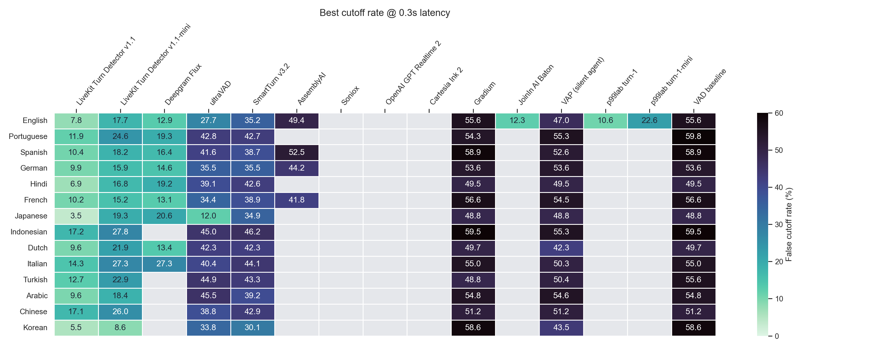
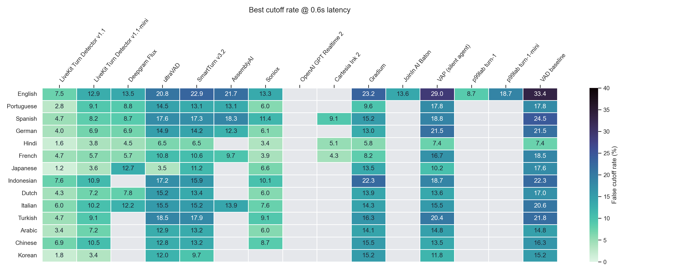
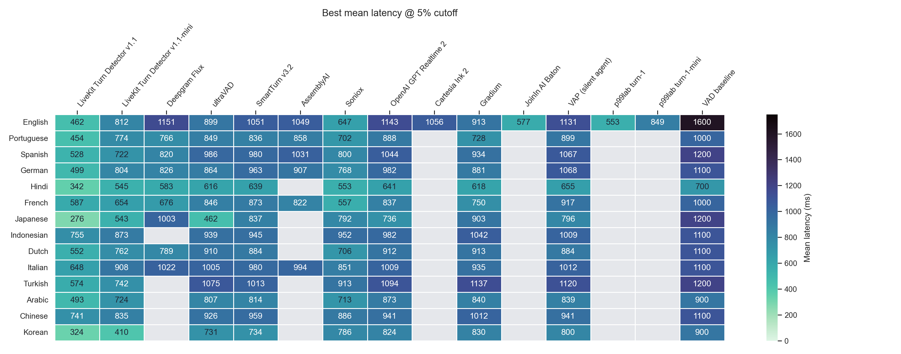
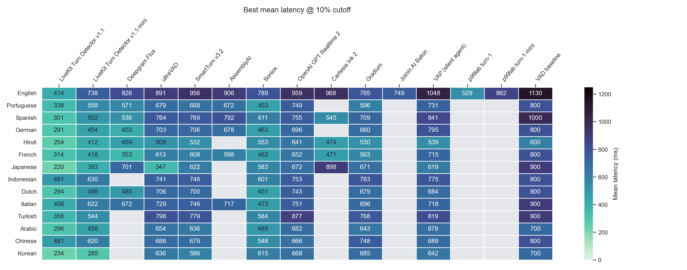

# EoT Language Comparison

## Best cutoff rate @ 0.3s latency

| Language | LiveKit Turn Detector v1.1 | LiveKit Turn Detector v1.1-mini | Deepgram Flux | ultraVAD | SmartTurn v3.2 | AssemblyAI | Soniox | OpenAI GPT Realtime 2 | Cartesia Ink 2 | Gradium | JoinIn AI Baton | VAP (silent agent) | p99lab turn-1 | p99lab turn-1-mini | VAD baseline |
| --- | --- | --- | --- | --- | --- | --- | --- | --- | --- | --- | --- | --- | --- | --- | --- |
| ar | 9.6% | 18.4% | - | 45.5% | 39.2% | - | - | - | - | 54.8% | - | 54.6% | - | - | 54.8% |
| de | 9.9% | 15.9% | 14.6% | 35.5% | 35.5% | 44.2% | - | - | - | 53.6% | - | 53.6% | - | - | 53.6% |
| en | 7.8% | 17.7% | 12.9% | 27.7% | 35.2% | 49.4% | - | - | - | 55.6% | 12.3% | 47.0% | 10.6% | 22.6% | 55.6% |
| es | 10.4% | 18.2% | 16.4% | 41.6% | 38.7% | 52.5% | - | - | - | 58.9% | - | 52.6% | - | - | 58.9% |
| fr | 10.2% | 15.2% | 13.1% | 34.4% | 38.9% | 41.8% | - | - | - | 56.6% | - | 54.5% | - | - | 56.6% |
| hi | 6.9% | 16.8% | 19.2% | 39.1% | 42.6% | - | - | - | - | 49.5% | - | 49.5% | - | - | 49.5% |
| id | 17.2% | 27.8% | - | 45.0% | 46.2% | - | - | - | - | 59.5% | - | 55.3% | - | - | 59.5% |
| it | 14.3% | 27.3% | 27.3% | 40.4% | 44.1% | - | - | - | - | 55.0% | - | 50.3% | - | - | 55.0% |
| ja | 3.5% | 19.3% | 20.6% | 12.0% | 34.9% | - | - | - | - | 48.8% | - | 48.8% | - | - | 48.8% |
| ko | 5.5% | 8.6% | - | 33.8% | 30.1% | - | - | - | - | 58.6% | - | 43.5% | - | - | 58.6% |
| nl | 9.6% | 21.9% | 13.4% | 42.3% | 42.3% | - | - | - | - | 49.7% | - | 42.3% | - | - | 49.7% |
| pt | 11.9% | 24.6% | 19.3% | 42.8% | 42.7% | - | - | - | - | 54.3% | - | 55.3% | - | - | 59.8% |
| tr | 12.7% | 22.9% | - | 44.9% | 43.3% | - | - | - | - | 48.8% | - | 50.4% | - | - | 55.6% |
| zh | 17.1% | 26.0% | - | 38.8% | 42.9% | - | - | - | - | 51.2% | - | 51.2% | - | - | 51.2% |

## Best cutoff rate @ 0.6s latency

| Language | LiveKit Turn Detector v1.1 | LiveKit Turn Detector v1.1-mini | Deepgram Flux | ultraVAD | SmartTurn v3.2 | AssemblyAI | Soniox | OpenAI GPT Realtime 2 | Cartesia Ink 2 | Gradium | JoinIn AI Baton | VAP (silent agent) | p99lab turn-1 | p99lab turn-1-mini | VAD baseline |
| --- | --- | --- | --- | --- | --- | --- | --- | --- | --- | --- | --- | --- | --- | --- | --- |
| ar | 3.4% | 7.2% | - | 12.9% | 13.2% | - | 6.0% | - | - | 14.1% | - | 14.8% | - | - | 14.8% |
| de | 4.0% | 6.9% | 6.9% | 14.9% | 14.2% | 12.3% | 6.1% | - | - | 13.0% | - | 21.5% | - | - | 21.5% |
| en | 4.1% | 8.2% | 9.9% | 11.9% | 14.8% | 14.6% | 5.5% | - | - | 12.6% | 4.8% | 14.6% | 4.5% | 9.6% | 21.7% |
| es | 4.7% | 8.2% | 8.7% | 17.6% | 17.3% | 18.3% | 11.4% | - | - | 15.2% | - | 18.8% | - | - | 24.5% |
| fr | 4.7% | 5.7% | 5.7% | 10.8% | 10.6% | 9.7% | 3.9% | - | - | 8.2% | - | 16.7% | - | - | 18.5% |
| hi | 1.6% | 3.8% | 4.5% | 6.5% | 6.5% | - | 3.4% | - | - | 5.8% | - | 7.4% | - | - | 7.4% |
| id | 7.6% | 10.9% | - | 17.2% | 15.9% | - | 10.1% | - | - | 22.3% | - | 18.7% | - | - | 22.3% |
| it | 6.0% | 10.2% | 12.2% | 15.5% | 15.2% | 13.9% | 7.6% | - | - | 14.3% | - | 15.5% | - | - | 20.6% |
| ja | 1.2% | 3.6% | 12.7% | 3.5% | 11.2% | - | 6.6% | - | - | 13.5% | - | 10.2% | - | - | 17.6% |
| ko | 1.8% | 3.4% | - | 12.0% | 9.7% | - | - | - | - | 15.2% | - | 11.8% | - | - | 15.2% |
| nl | 4.3% | 7.2% | 7.8% | 15.2% | 13.4% | - | 6.0% | - | - | 13.9% | - | 13.6% | - | - | 17.0% |
| pt | 2.8% | 9.1% | 8.8% | 14.5% | 13.1% | 13.1% | 6.0% | - | - | 9.6% | - | 17.8% | - | - | 17.8% |
| tr | 4.7% | 9.1% | - | 18.5% | 17.9% | - | 9.1% | - | - | 16.3% | - | 20.4% | - | - | 21.8% |
| zh | 6.9% | 10.5% | - | 12.8% | 13.2% | - | 8.7% | - | - | 15.5% | - | 13.5% | - | - | 16.3% |

## Best mean latency @ 5% cutoff

| Language | LiveKit Turn Detector v1.1 | LiveKit Turn Detector v1.1-mini | Deepgram Flux | ultraVAD | SmartTurn v3.2 | AssemblyAI | Soniox | OpenAI GPT Realtime 2 | Cartesia Ink 2 | Gradium | JoinIn AI Baton | VAP (silent agent) | p99lab turn-1 | p99lab turn-1-mini | VAD baseline |
| --- | --- | --- | --- | --- | --- | --- | --- | --- | --- | --- | --- | --- | --- | --- | --- |
| ar | 493 ms | 724 ms | - | 807 ms | 814 ms | - | 713 ms | 873 ms | - | 840 ms | - | 839 ms | - | - | 900 ms |
| de | 499 ms | 804 ms | 826 ms | 864 ms | 963 ms | 907 ms | 768 ms | 982 ms | - | 881 ms | - | 1068 ms | - | - | 1100 ms |
| en | 462 ms | 812 ms | 1151 ms | 899 ms | 1051 ms | 1049 ms | 647 ms | 1143 ms | 1056 ms | 913 ms | 577 ms | 1131 ms | 553 ms | 849 ms | 1600 ms |
| es | 528 ms | 722 ms | 820 ms | 986 ms | 980 ms | 1031 ms | 800 ms | 1044 ms | - | 934 ms | - | 1067 ms | - | - | 1200 ms |
| fr | 587 ms | 654 ms | 676 ms | 846 ms | 873 ms | 822 ms | 557 ms | 837 ms | - | 750 ms | - | 917 ms | - | - | 1000 ms |
| hi | 342 ms | 545 ms | 583 ms | 616 ms | 639 ms | - | 553 ms | 641 ms | - | 618 ms | - | 655 ms | - | - | 700 ms |
| id | 755 ms | 873 ms | - | 939 ms | 945 ms | - | 952 ms | 982 ms | - | 1042 ms | - | 1009 ms | - | - | 1100 ms |
| it | 648 ms | 908 ms | 1022 ms | 1005 ms | 980 ms | 994 ms | 851 ms | 1009 ms | - | 935 ms | - | 1012 ms | - | - | 1100 ms |
| ja | 276 ms | 543 ms | 1003 ms | 462 ms | 837 ms | - | 792 ms | 736 ms | - | 903 ms | - | 796 ms | - | - | 1200 ms |
| ko | 324 ms | 410 ms | - | 731 ms | 734 ms | - | 786 ms | 824 ms | - | 830 ms | - | 800 ms | - | - | 900 ms |
| nl | 552 ms | 762 ms | 789 ms | 910 ms | 884 ms | - | 706 ms | 912 ms | - | 913 ms | - | 884 ms | - | - | 1100 ms |
| pt | 454 ms | 774 ms | 766 ms | 849 ms | 836 ms | 858 ms | 702 ms | 888 ms | - | 728 ms | - | 899 ms | - | - | 1000 ms |
| tr | 574 ms | 742 ms | - | 1075 ms | 1013 ms | - | 913 ms | 1094 ms | - | 1137 ms | - | 1120 ms | - | - | 1200 ms |
| zh | 741 ms | 835 ms | - | 926 ms | 959 ms | - | 886 ms | 941 ms | - | 1012 ms | - | 941 ms | - | - | 1100 ms |

## Best mean latency @ 10% cutoff

| Language | LiveKit Turn Detector v1.1 | LiveKit Turn Detector v1.1-mini | Deepgram Flux | ultraVAD | SmartTurn v3.2 | AssemblyAI | Soniox | OpenAI GPT Realtime 2 | Cartesia Ink 2 | Gradium | JoinIn AI Baton | VAP (silent agent) | p99lab turn-1 | p99lab turn-1-mini | VAD baseline |
| --- | --- | --- | --- | --- | --- | --- | --- | --- | --- | --- | --- | --- | --- | --- | --- |
| ar | 296 ms | 458 ms | - | 654 ms | 636 ms | - | 489 ms | 682 ms | - | 643 ms | - | 678 ms | - | - | 700 ms |
| de | 291 ms | 454 ms | 403 ms | 703 ms | 706 ms | 678 ms | 463 ms | 696 ms | - | 680 ms | - | 795 ms | - | - | 800 ms |
| en | 250 ms | 504 ms | 548 ms | 663 ms | 739 ms | 713 ms | 512 ms | 824 ms | 911 ms | 656 ms | 350 ms | 749 ms | 321 ms | 580 ms | 1000 ms |
| es | 301 ms | 502 ms | 536 ms | 764 ms | 769 ms | 792 ms | 611 ms | 755 ms | - | 709 ms | - | 841 ms | - | - | 1000 ms |
| fr | 314 ms | 418 ms | 353 ms | 613 ms | 608 ms | 598 ms | 463 ms | 652 ms | - | 563 ms | - | 715 ms | - | - | 800 ms |
| hi | 254 ms | 412 ms | 459 ms | 509 ms | 532 ms | - | 553 ms | 641 ms | - | 530 ms | - | 539 ms | - | - | 600 ms |
| id | 481 ms | 630 ms | - | 741 ms | 748 ms | - | 601 ms | 753 ms | - | 783 ms | - | 775 ms | - | - | 800 ms |
| it | 408 ms | 622 ms | 672 ms | 729 ms | 746 ms | 717 ms | 473 ms | 751 ms | - | 696 ms | - | 718 ms | - | - | 900 ms |
| ja | 220 ms | 393 ms | 701 ms | 347 ms | 622 ms | - | 583 ms | 672 ms | - | 671 ms | - | 619 ms | - | - | 900 ms |
| ko | 234 ms | 285 ms | - | 636 ms | 586 ms | - | 615 ms | 668 ms | - | 685 ms | - | 642 ms | - | - | 700 ms |
| nl | 294 ms | 496 ms | 485 ms | 706 ms | 700 ms | - | 451 ms | 743 ms | - | 679 ms | - | 684 ms | - | - | 800 ms |
| pt | 338 ms | 558 ms | 571 ms | 679 ms | 668 ms | 672 ms | 453 ms | 749 ms | - | 596 ms | - | 731 ms | - | - | 800 ms |
| tr | 358 ms | 544 ms | - | 798 ms | 779 ms | - | 584 ms | 877 ms | - | 768 ms | - | 819 ms | - | - | 900 ms |
| zh | 481 ms | 620 ms | - | 688 ms | 679 ms | - | 548 ms | 666 ms | - | 748 ms | - | 689 ms | - | - | 800 ms |
