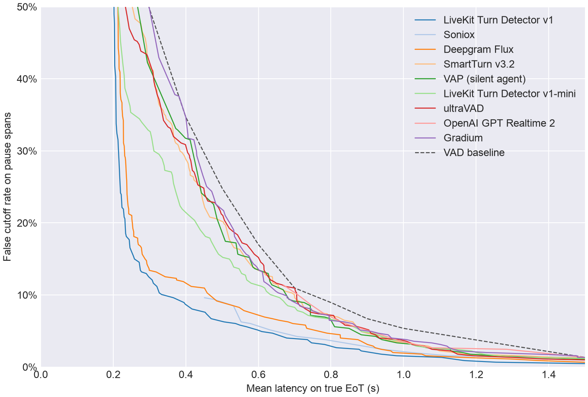
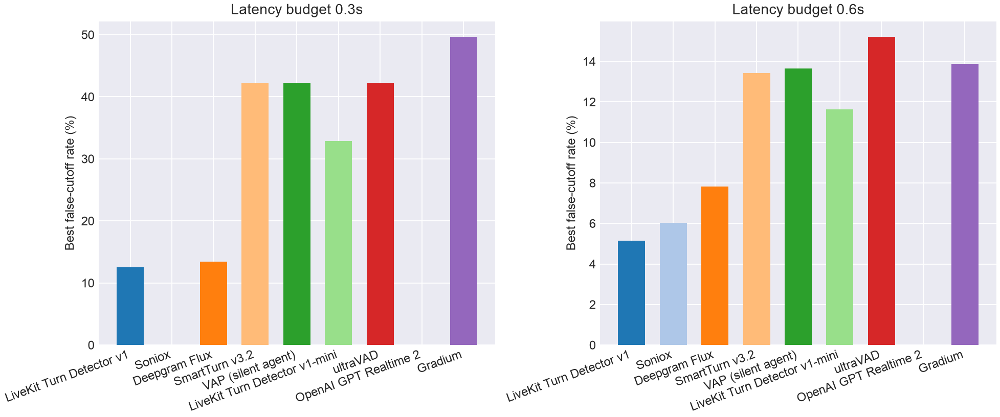
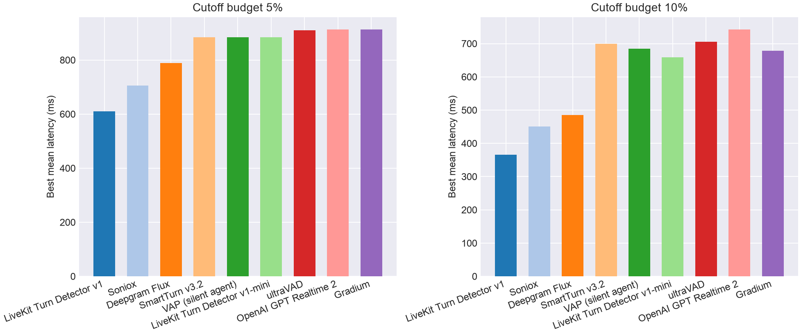

# EoT Model Comparison

## Pareto Frontier

## Best Cutoff Rate at Latency Budget

| Model | Best cutoff rate @ 0.3s latency | Best cutoff rate @ 0.6s latency |
| --- | --- | --- |
| LiveKit Turn Detector v1 | **12.5%** | **5.1%** |
| Soniox | - | 6.0% |
| Deepgram Flux | 13.4% | 7.8% |
| SmartTurn v3.2 | 42.3% | 13.4% |
| VAP (silent agent) | 42.3% | 13.6% |
| LiveKit Turn Detector v1-mini | 32.9% | 11.6% |
| ultraVAD | 42.3% | 15.2% |
| OpenAI GPT Realtime 2 | - | - |
| Gradium | 49.7% | 13.9% |
| VAD baseline | 49.7% | 17.0% |

## Best Latency at Cutoff Budget

| Model | Best mean latency @ 5% cutoff | Best mean latency @ 10% cutoff |
| --- | --- | --- |
| LiveKit Turn Detector v1 | **610 ms** | **366 ms** |
| Soniox | 706 ms | 451 ms |
| Deepgram Flux | 789 ms | 485 ms |
| SmartTurn v3.2 | 884 ms | 700 ms |
| VAP (silent agent) | 884 ms | 684 ms |
| LiveKit Turn Detector v1-mini | 884 ms | 659 ms |
| ultraVAD | 910 ms | 706 ms |
| OpenAI GPT Realtime 2 | 912 ms | 743 ms |
| Gradium | 913 ms | 679 ms |
| VAD baseline | 1100 ms | 800 ms |

## Operating Points

| Type | Budget | Model | Mean Latency | Cutoff | Detect | Threshold | Action Delay | Timeout |
| --- | --- | --- | --- | --- | --- | --- | --- | --- |
| Cutoff | 5.0% | LiveKit Turn Detector v1 | 0.610 | 4.9% | 68.5% | 0.950 | 0.200 | 1.500 |
| Cutoff | 5.0% | Soniox | 0.706 | 4.3% | 79.8% | 0.990 | 0.500 | 1.500 |
| Cutoff | 5.0% | Deepgram Flux | 0.789 | 4.7% | 96.2% | 0.700 | 0.700 | 3.000 |
| Cutoff | 5.0% | SmartTurn v3.2 | 0.883 | 4.9% | 68.5% | 0.940 | 0.600 | 1.500 |
| Cutoff | 5.0% | VAP (silent agent) | 0.884 | 4.5% | 92.0% | 0.050 | 0.800 | 1.500 |
| Cutoff | 5.0% | LiveKit Turn Detector v1-mini | 0.884 | 4.9% | 77.0% | 0.340 | 0.700 | 1.500 |
| Cutoff | 5.0% | ultraVAD | 0.910 | 4.7% | 73.8% | 0.200 | 0.700 | 1.500 |
| Cutoff | 5.0% | OpenAI GPT Realtime 2 | 0.912 | 4.9% | 85.8% | 0.990 | 0.800 | 1.500 |
| Cutoff | 5.0% | Gradium | 0.913 | 4.9% | 85.0% | 0.230 | 0.800 | 1.500 |
| Cutoff | 10.0% | LiveKit Turn Detector v1 | 0.366 | 9.6% | 87.2% | 0.840 | 0.200 | 1.500 |
| Cutoff | 10.0% | Soniox | 0.451 | 9.6% | 79.8% | 0.990 | 0.200 | 1.000 |
| Cutoff | 10.0% | Deepgram Flux | 0.485 | 9.2% | 81.2% | 0.740 | 0.200 | 1.500 |
| Cutoff | 10.0% | SmartTurn v3.2 | 0.700 | 9.6% | 60.0% | 0.970 | 0.500 | 1.000 |
| Cutoff | 10.0% | VAP (silent agent) | 0.684 | 9.4% | 92.0% | 0.050 | 0.500 | 1.500 |
| Cutoff | 10.0% | LiveKit Turn Detector v1-mini | 0.659 | 9.6% | 68.2% | 0.390 | 0.500 | 1.000 |
| Cutoff | 10.0% | ultraVAD | 0.706 | 9.2% | 99.2% | 0.010 | 0.700 | 1.500 |
| Cutoff | 10.0% | OpenAI GPT Realtime 2 | 0.743 | 8.7% | 85.8% | 0.990 | 0.200 | 1.500 |
| Cutoff | 10.0% | Gradium | 0.679 | 9.8% | 88.8% | 0.190 | 0.500 | 1.500 |
| Latency | 300ms | LiveKit Turn Detector v1 | 0.298 | 12.5% | 92.5% | 0.720 | 0.200 | 1.500 |
| Latency | 300ms | Soniox | - | - | - | - | - | - |
| Latency | 300ms | Deepgram Flux | 0.299 | 13.4% | 96.2% | 0.700 | 0.200 | 1.500 |
| Latency | 300ms | SmartTurn v3.2 | 0.296 | 42.3% | 88.0% | 0.120 | 0.200 | 1.000 |
| Latency | 300ms | VAP (silent agent) | 0.294 | 42.3% | 98.2% | 0.020 | 0.200 | 1.000 |
| Latency | 300ms | LiveKit Turn Detector v1-mini | 0.296 | 32.9% | 88.0% | 0.230 | 0.200 | 1.000 |
| Latency | 300ms | ultraVAD | 0.300 | 42.3% | 87.5% | 0.110 | 0.200 | 1.000 |
| Latency | 300ms | OpenAI GPT Realtime 2 | - | - | - | - | - | - |
| Latency | 300ms | Gradium | 0.300 | 49.7% | 100.0% | 0.000 | 0.300 | 1.000 |
| Latency | 600ms | LiveKit Turn Detector v1 | 0.598 | 5.1% | 90.2% | 0.790 | 0.500 | 1.500 |
| Latency | 600ms | Soniox | 0.578 | 6.0% | 79.8% | 0.990 | 0.300 | 1.500 |
| Latency | 600ms | Deepgram Flux | 0.560 | 7.8% | 75.2% | 0.750 | 0.200 | 1.500 |
| Latency | 600ms | SmartTurn v3.2 | 0.600 | 13.4% | 66.8% | 0.950 | 0.400 | 1.000 |
| Latency | 600ms | VAP (silent agent) | 0.590 | 13.6% | 92.0% | 0.050 | 0.300 | 1.500 |
| Latency | 600ms | LiveKit Turn Detector v1-mini | 0.580 | 11.6% | 52.5% | 0.500 | 0.200 | 1.000 |
| Latency | 600ms | ultraVAD | 0.600 | 15.2% | 80.0% | 0.170 | 0.500 | 1.000 |
| Latency | 600ms | OpenAI GPT Realtime 2 | - | - | - | - | - | - |
| Latency | 600ms | Gradium | 0.596 | 13.9% | 90.0% | 0.150 | 0.500 | 1.000 |
