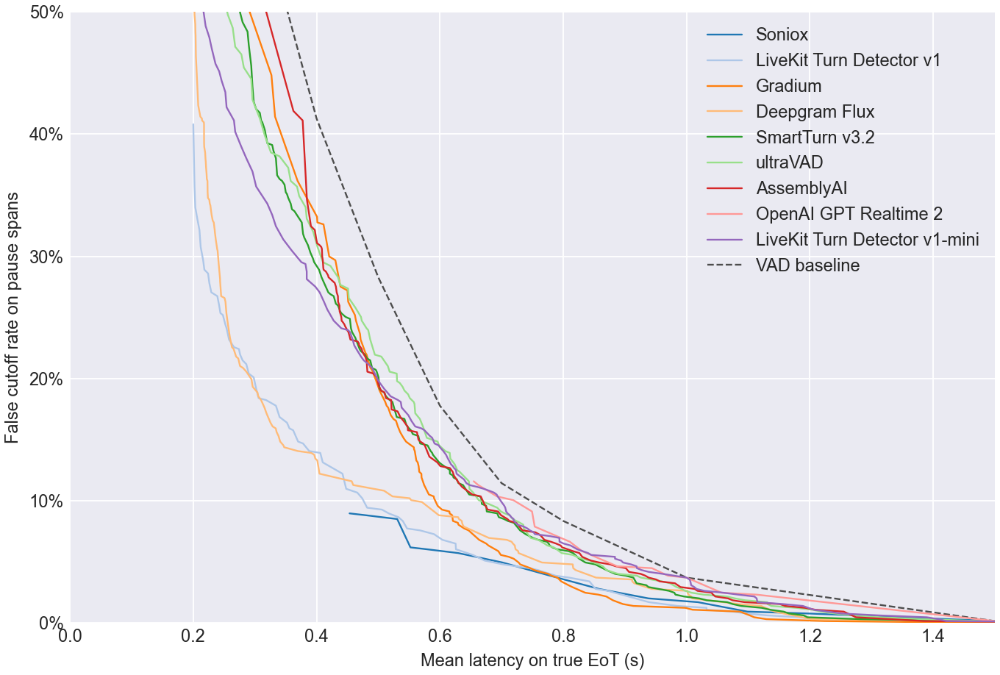
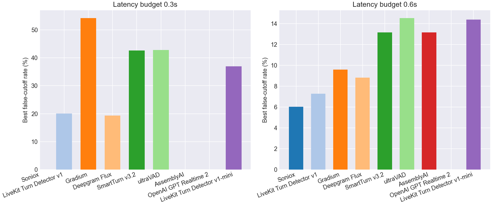
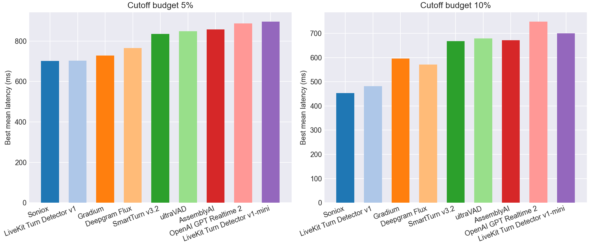

# EoT Model Comparison

## Pareto Frontier

## Best Cutoff Rate at Latency Budget

| Model | Best cutoff rate @ 0.3s latency | Best cutoff rate @ 0.6s latency |
| --- | --- | --- |
| Soniox | - | **6.0%** |
| LiveKit Turn Detector v1 | 20.1% | 7.3% |
| Gradium | 54.3% | 9.6% |
| Deepgram Flux | **19.3%** | 8.8% |
| SmartTurn v3.2 | 42.7% | 13.1% |
| ultraVAD | 42.8% | 14.5% |
| AssemblyAI | - | 13.1% |
| OpenAI GPT Realtime 2 | - | - |
| LiveKit Turn Detector v1-mini | 36.9% | 14.4% |
| VAD baseline | 59.8% | 17.8% |

## Best Latency at Cutoff Budget

| Model | Best mean latency @ 5% cutoff | Best mean latency @ 10% cutoff |
| --- | --- | --- |
| Soniox | **702 ms** | **453 ms** |
| LiveKit Turn Detector v1 | 702 ms | 482 ms |
| Gradium | 728 ms | 596 ms |
| Deepgram Flux | 766 ms | 571 ms |
| SmartTurn v3.2 | 836 ms | 668 ms |
| ultraVAD | 849 ms | 679 ms |
| AssemblyAI | 858 ms | 672 ms |
| OpenAI GPT Realtime 2 | 888 ms | 749 ms |
| LiveKit Turn Detector v1-mini | 897 ms | 700 ms |
| VAD baseline | 1000 ms | 800 ms |

## Operating Points

| Type | Budget | Model | Mean Latency | Cutoff | Detect | Threshold | Action Delay | Timeout |
| --- | --- | --- | --- | --- | --- | --- | --- | --- |
| Cutoff | 5.0% | Soniox | 0.702 | 4.9% | 80.2% | 0.990 | 0.500 | 1.500 |
| Cutoff | 5.0% | LiveKit Turn Detector v1 | 0.703 | 4.8% | 42.5% | 0.960 | 0.300 | 1.000 |
| Cutoff | 5.0% | Gradium | 0.728 | 4.9% | 89.0% | 0.400 | 0.500 | 1.500 |
| Cutoff | 5.0% | Deepgram Flux | 0.766 | 4.9% | 93.2% | 0.710 | 0.700 | 1.500 |
| Cutoff | 5.0% | SmartTurn v3.2 | 0.836 | 4.9% | 83.0% | 0.470 | 0.700 | 1.500 |
| Cutoff | 5.0% | ultraVAD | 0.849 | 4.9% | 50.2% | 0.440 | 0.700 | 1.000 |
| Cutoff | 5.0% | AssemblyAI | 0.858 | 4.9% | 49.0% | 0.950 | 0.700 | 1.000 |
| Cutoff | 5.0% | OpenAI GPT Realtime 2 | 0.888 | 4.6% | 88.8% | 0.990 | 0.800 | 1.500 |
| Cutoff | 5.0% | LiveKit Turn Detector v1-mini | 0.897 | 4.9% | 51.5% | 0.540 | 0.800 | 1.000 |
| Cutoff | 10.0% | Soniox | 0.453 | 9.0% | 80.2% | 0.990 | 0.200 | 1.000 |
| Cutoff | 10.0% | LiveKit Turn Detector v1 | 0.482 | 9.4% | 64.8% | 0.880 | 0.200 | 1.000 |
| Cutoff | 10.0% | Gradium | 0.596 | 9.6% | 93.2% | 0.250 | 0.500 | 1.000 |
| Cutoff | 10.0% | Deepgram Flux | 0.571 | 9.9% | 88.5% | 0.720 | 0.400 | 1.500 |
| Cutoff | 10.0% | SmartTurn v3.2 | 0.668 | 9.7% | 83.0% | 0.470 | 0.600 | 1.000 |
| Cutoff | 10.0% | ultraVAD | 0.679 | 9.7% | 80.2% | 0.240 | 0.600 | 1.000 |
| Cutoff | 10.0% | AssemblyAI | 0.672 | 9.7% | 70.8% | 0.840 | 0.500 | 1.000 |
| Cutoff | 10.0% | OpenAI GPT Realtime 2 | 0.749 | 9.1% | 88.8% | 0.990 | 0.600 | 1.500 |
| Cutoff | 10.0% | LiveKit Turn Detector v1-mini | 0.700 | 9.9% | 60.0% | 0.500 | 0.500 | 1.000 |
| Latency | 300ms | Soniox | - | - | - | - | - | - |
| Latency | 300ms | LiveKit Turn Detector v1 | 0.298 | 20.1% | 87.8% | 0.690 | 0.200 | 1.000 |
| Latency | 300ms | Gradium | 0.263 | 54.3% | 98.8% | 0.010 | 0.200 | 1.000 |
| Latency | 300ms | Deepgram Flux | 0.296 | 19.3% | 98.8% | 0.570 | 0.200 | 1.500 |
| Latency | 300ms | SmartTurn v3.2 | 0.298 | 42.7% | 87.8% | 0.220 | 0.200 | 1.000 |
| Latency | 300ms | ultraVAD | 0.296 | 42.8% | 88.0% | 0.180 | 0.200 | 1.000 |
| Latency | 300ms | AssemblyAI | - | - | - | - | - | - |
| Latency | 300ms | OpenAI GPT Realtime 2 | - | - | - | - | - | - |
| Latency | 300ms | LiveKit Turn Detector v1-mini | 0.296 | 36.9% | 88.0% | 0.300 | 0.200 | 1.000 |
| Latency | 600ms | Soniox | 0.579 | 6.0% | 80.2% | 0.990 | 0.300 | 1.500 |
| Latency | 600ms | LiveKit Turn Detector v1 | 0.591 | 7.3% | 58.5% | 0.910 | 0.300 | 1.000 |
| Latency | 600ms | Gradium | 0.596 | 9.6% | 93.2% | 0.250 | 0.500 | 1.000 |
| Latency | 600ms | Deepgram Flux | 0.598 | 8.8% | 93.2% | 0.710 | 0.500 | 1.500 |
| Latency | 600ms | SmartTurn v3.2 | 0.599 | 13.1% | 80.2% | 0.630 | 0.500 | 1.000 |
| Latency | 600ms | ultraVAD | 0.599 | 14.5% | 80.2% | 0.240 | 0.500 | 1.000 |
| Latency | 600ms | AssemblyAI | 0.596 | 13.1% | 75.8% | 0.790 | 0.400 | 1.000 |
| Latency | 600ms | OpenAI GPT Realtime 2 | - | - | - | - | - | - |
| Latency | 600ms | LiveKit Turn Detector v1-mini | 0.600 | 14.4% | 80.0% | 0.370 | 0.500 | 1.000 |
