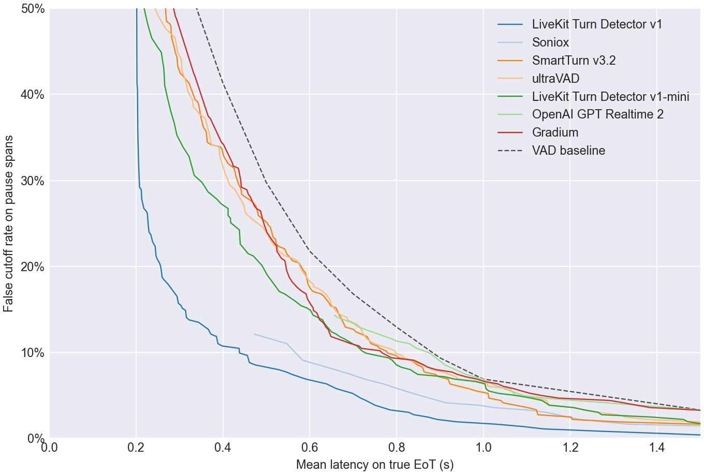
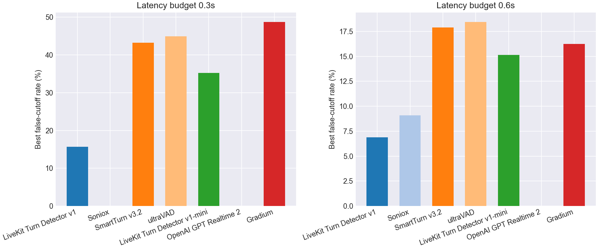
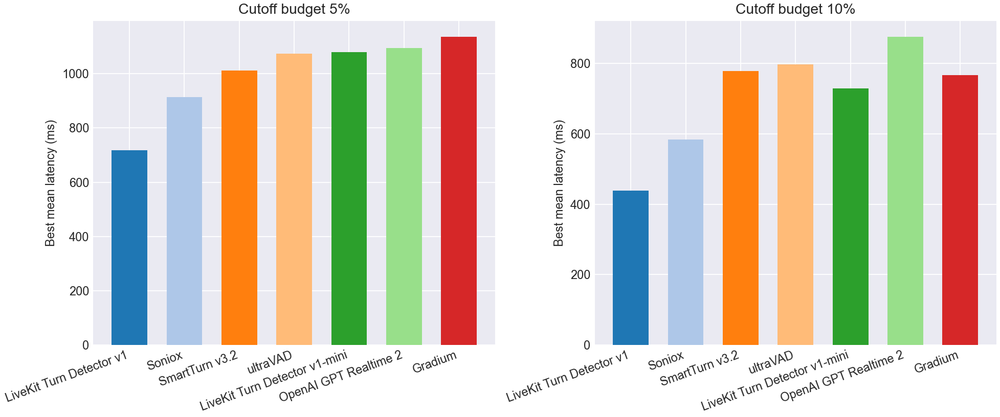

# EoT Model Comparison

## Pareto Frontier

## Best Cutoff Rate at Latency Budget

| Model | Best cutoff rate @ 0.3s latency | Best cutoff rate @ 0.6s latency |
| --- | --- | --- |
| LiveKit Turn Detector v1 | **15.7%** | **6.9%** |
| Soniox | - | 9.1% |
| SmartTurn v3.2 | 43.3% | 17.9% |
| ultraVAD | 44.9% | 18.5% |
| LiveKit Turn Detector v1-mini | 35.3% | 15.2% |
| OpenAI GPT Realtime 2 | - | - |
| Gradium | 48.8% | 16.3% |
| VAD baseline | 55.6% | 21.8% |

## Best Latency at Cutoff Budget

| Model | Best mean latency @ 5% cutoff | Best mean latency @ 10% cutoff |
| --- | --- | --- |
| LiveKit Turn Detector v1 | **718 ms** | **439 ms** |
| Soniox | 913 ms | 584 ms |
| SmartTurn v3.2 | 1013 ms | 779 ms |
| ultraVAD | 1075 ms | 798 ms |
| LiveKit Turn Detector v1-mini | 1080 ms | 729 ms |
| OpenAI GPT Realtime 2 | 1094 ms | 877 ms |
| Gradium | 1137 ms | 768 ms |
| VAD baseline | 1200 ms | 900 ms |

## Operating Points

| Type | Budget | Model | Mean Latency | Cutoff | Detect | Threshold | Action Delay | Timeout |
| --- | --- | --- | --- | --- | --- | --- | --- | --- |
| Cutoff | 5.0% | LiveKit Turn Detector v1 | 0.718 | 4.7% | 85.5% | 0.860 | 0.500 | 2.000 |
| Cutoff | 5.0% | Soniox | 0.913 | 4.1% | 78.0% | 0.990 | 0.600 | 2.000 |
| Cutoff | 5.0% | SmartTurn v3.2 | 1.013 | 4.7% | 89.8% | 0.340 | 0.900 | 2.000 |
| Cutoff | 5.0% | ultraVAD | 1.075 | 5.0% | 85.0% | 0.120 | 1.000 | 1.500 |
| Cutoff | 5.0% | LiveKit Turn Detector v1-mini | 1.080 | 5.0% | 92.0% | 0.200 | 1.000 | 2.000 |
| Cutoff | 5.0% | OpenAI GPT Realtime 2 | 1.094 | 5.0% | 90.8% | 0.990 | 1.000 | 2.000 |
| Cutoff | 5.0% | Gradium | 1.137 | 5.0% | 75.2% | 0.420 | 1.000 | 1.500 |
| Cutoff | 10.0% | LiveKit Turn Detector v1 | 0.439 | 9.9% | 86.8% | 0.840 | 0.200 | 2.000 |
| Cutoff | 10.0% | Soniox | 0.584 | 9.1% | 77.8% | 0.990 | 0.200 | 1.500 |
| Cutoff | 10.0% | SmartTurn v3.2 | 0.779 | 9.9% | 73.5% | 0.910 | 0.700 | 1.000 |
| Cutoff | 10.0% | ultraVAD | 0.798 | 9.9% | 67.2% | 0.210 | 0.700 | 1.000 |
| Cutoff | 10.0% | LiveKit Turn Detector v1-mini | 0.729 | 9.9% | 67.8% | 0.380 | 0.600 | 1.000 |
| Cutoff | 10.0% | OpenAI GPT Realtime 2 | 0.877 | 9.9% | 90.8% | 0.990 | 0.800 | 1.500 |
| Cutoff | 10.0% | Gradium | 0.768 | 9.9% | 86.8% | 0.310 | 0.500 | 1.500 |
| Latency | 300ms | LiveKit Turn Detector v1 | 0.298 | 15.7% | 92.5% | 0.720 | 0.200 | 1.500 |
| Latency | 300ms | Soniox | - | - | - | - | - | - |
| Latency | 300ms | SmartTurn v3.2 | 0.296 | 43.3% | 88.0% | 0.460 | 0.200 | 1.000 |
| Latency | 300ms | ultraVAD | 0.296 | 44.9% | 88.0% | 0.080 | 0.200 | 1.000 |
| Latency | 300ms | LiveKit Turn Detector v1-mini | 0.294 | 35.3% | 88.2% | 0.250 | 0.200 | 1.000 |
| Latency | 300ms | OpenAI GPT Realtime 2 | - | - | - | - | - | - |
| Latency | 300ms | Gradium | 0.293 | 48.8% | 99.5% | 0.020 | 0.200 | 1.500 |
| Latency | 600ms | LiveKit Turn Detector v1 | 0.592 | 6.9% | 78.2% | 0.920 | 0.200 | 2.000 |
| Latency | 600ms | Soniox | 0.584 | 9.1% | 77.8% | 0.990 | 0.200 | 1.500 |
| Latency | 600ms | SmartTurn v3.2 | 0.596 | 17.9% | 80.8% | 0.790 | 0.500 | 1.000 |
| Latency | 600ms | ultraVAD | 0.597 | 18.5% | 67.2% | 0.210 | 0.400 | 1.000 |
| Latency | 600ms | LiveKit Turn Detector v1-mini | 0.594 | 15.2% | 50.7% | 0.480 | 0.200 | 1.000 |
| Latency | 600ms | OpenAI GPT Realtime 2 | - | - | - | - | - | - |
| Latency | 600ms | Gradium | 0.595 | 16.3% | 93.8% | 0.170 | 0.500 | 1.000 |
