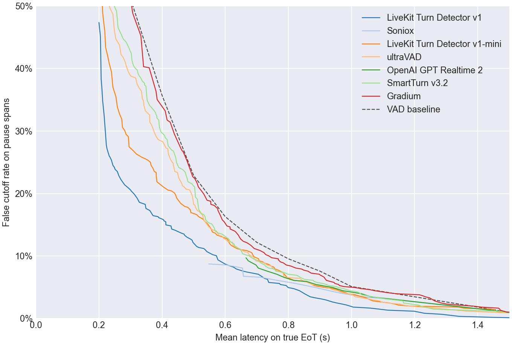
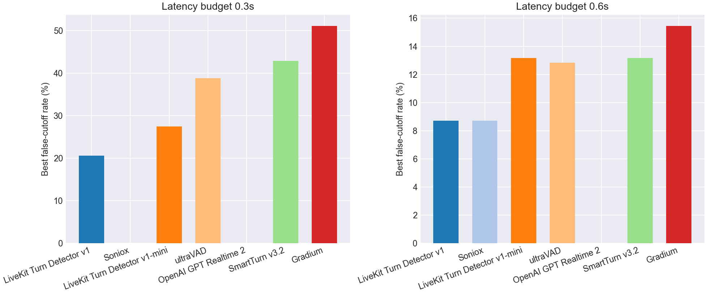
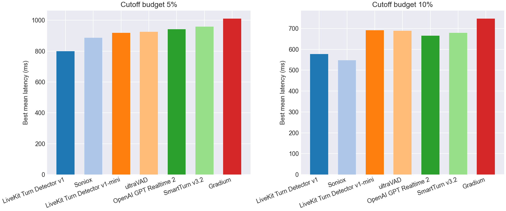

# EoT Model Comparison

## Pareto Frontier

## Best Cutoff Rate at Latency Budget

| Model | Best cutoff rate @ 0.3s latency | Best cutoff rate @ 0.6s latency |
| --- | --- | --- |
| LiveKit Turn Detector v1 | **20.6%** | **8.7%** |
| Soniox | - | **8.7%** |
| LiveKit Turn Detector v1-mini | 27.5% | 13.2% |
| ultraVAD | 38.8% | 12.8% |
| OpenAI GPT Realtime 2 | - | - |
| SmartTurn v3.2 | 42.9% | 13.2% |
| Gradium | 51.2% | 15.5% |
| VAD baseline | 51.2% | 16.3% |

## Best Latency at Cutoff Budget

| Model | Best mean latency @ 5% cutoff | Best mean latency @ 10% cutoff |
| --- | --- | --- |
| LiveKit Turn Detector v1 | **799 ms** | 577 ms |
| Soniox | 886 ms | **548 ms** |
| LiveKit Turn Detector v1-mini | 919 ms | 691 ms |
| ultraVAD | 926 ms | 688 ms |
| OpenAI GPT Realtime 2 | 941 ms | 666 ms |
| SmartTurn v3.2 | 959 ms | 679 ms |
| Gradium | 1012 ms | 748 ms |
| VAD baseline | 1100 ms | 800 ms |

## Operating Points

| Type | Budget | Model | Mean Latency | Cutoff | Detect | Threshold | Action Delay | Timeout |
| --- | --- | --- | --- | --- | --- | --- | --- | --- |
| Cutoff | 5.0% | LiveKit Turn Detector v1 | 0.799 | 4.9% | 70.1% | 0.810 | 0.500 | 1.500 |
| Cutoff | 5.0% | Soniox | 0.886 | 4.9% | 79.4% | 0.990 | 0.700 | 1.500 |
| Cutoff | 5.0% | LiveKit Turn Detector v1-mini | 0.919 | 4.9% | 72.7% | 0.420 | 0.700 | 1.500 |
| Cutoff | 5.0% | ultraVAD | 0.926 | 4.9% | 82.0% | 0.270 | 0.800 | 1.500 |
| Cutoff | 5.0% | OpenAI GPT Realtime 2 | 0.941 | 4.9% | 93.9% | 0.990 | 0.900 | 1.500 |
| Cutoff | 5.0% | SmartTurn v3.2 | 0.959 | 4.9% | 77.3% | 0.560 | 0.800 | 1.500 |
| Cutoff | 5.0% | Gradium | 1.012 | 4.9% | 97.7% | 0.070 | 1.000 | 1.500 |
| Cutoff | 10.0% | LiveKit Turn Detector v1 | 0.577 | 9.4% | 60.5% | 0.860 | 0.300 | 1.000 |
| Cutoff | 10.0% | Soniox | 0.548 | 8.7% | 77.0% | 0.990 | 0.200 | 1.000 |
| Cutoff | 10.0% | LiveKit Turn Detector v1-mini | 0.691 | 9.9% | 77.3% | 0.380 | 0.600 | 1.000 |
| Cutoff | 10.0% | ultraVAD | 0.688 | 9.9% | 77.9% | 0.300 | 0.600 | 1.000 |
| Cutoff | 10.0% | OpenAI GPT Realtime 2 | 0.666 | 9.7% | 93.3% | 0.990 | 0.200 | 1.000 |
| Cutoff | 10.0% | SmartTurn v3.2 | 0.679 | 9.9% | 80.2% | 0.400 | 0.600 | 1.000 |
| Cutoff | 10.0% | Gradium | 0.748 | 9.7% | 82.6% | 0.250 | 0.600 | 1.000 |
| Latency | 300ms | LiveKit Turn Detector v1 | 0.300 | 20.6% | 87.5% | 0.620 | 0.200 | 1.000 |
| Latency | 300ms | Soniox | - | - | - | - | - | - |
| Latency | 300ms | LiveKit Turn Detector v1-mini | 0.295 | 27.5% | 88.1% | 0.300 | 0.200 | 1.000 |
| Latency | 300ms | ultraVAD | 0.300 | 38.8% | 87.5% | 0.210 | 0.200 | 1.000 |
| Latency | 300ms | OpenAI GPT Realtime 2 | - | - | - | - | - | - |
| Latency | 300ms | SmartTurn v3.2 | 0.298 | 42.9% | 87.8% | 0.140 | 0.200 | 1.000 |
| Latency | 300ms | Gradium | 0.300 | 51.2% | 100.0% | 0.000 | 0.300 | 1.000 |
| Latency | 600ms | LiveKit Turn Detector v1 | 0.599 | 8.7% | 57.3% | 0.870 | 0.300 | 1.000 |
| Latency | 600ms | Soniox | 0.548 | 8.7% | 77.0% | 0.990 | 0.200 | 1.000 |
| Latency | 600ms | LiveKit Turn Detector v1-mini | 0.584 | 13.2% | 83.1% | 0.340 | 0.500 | 1.000 |
| Latency | 600ms | ultraVAD | 0.594 | 12.8% | 81.1% | 0.280 | 0.500 | 1.000 |
| Latency | 600ms | OpenAI GPT Realtime 2 | - | - | - | - | - | - |
| Latency | 600ms | SmartTurn v3.2 | 0.599 | 13.2% | 80.2% | 0.400 | 0.500 | 1.000 |
| Latency | 600ms | Gradium | 0.597 | 15.5% | 94.8% | 0.130 | 0.500 | 1.000 |
